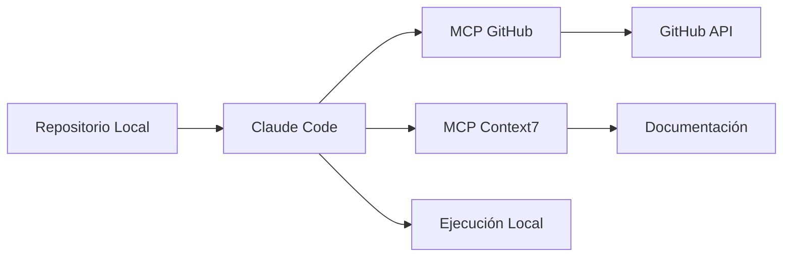

# Tutorial 1: Configuración Inicial del Entorno de Desarrollo con IA

## 🎯 Objetivo del Tutorial

En este primer tutorial aprenderás a configurar un entorno de desarrollo moderno que integra herramientas de Inteligencia Artificial para acelerar tu productividad como desarrollador. Utilizaremos **Claude Code**, el asistente de programación de Anthropic, junto con herramientas complementarias para gestión de proyectos.

## 📚 ¿Qué aprenderás?

- Configurar un repositorio Git desde cero
- Integrar Claude Code con tu proyecto
- Configurar Model Context Protocol (MCP) para GitHub
- Establecer permisos y configuraciones locales
- Documentar tu proyecto para colaboración con IA

## 🛠️ Herramientas que Utilizaremos

| Herramienta | Propósito |
|-------------|-----------|
| **Git** | Control de versiones |
| **Claude Code** | Asistente de IA para programación |
| **MCP GitHub** | Integración con repositorios GitHub |
| **Context7** | Gestión de contexto y documentación |
| **Docker** | Contenedorización de servicios |

## 📋 Pasos Realizados

### 1. Inicialización del Repositorio

Comenzamos con un repositorio Git básico que solo contenía:
```
data-projects-lab/
└── LICENSE (MIT)
```

### 2. Creación del archivo CLAUDE.md

Este archivo es fundamental - le indica a Claude Code cómo trabajar con nuestro proyecto. Incluye:

- **Descripción del proyecto**: Repositorio educativo para IA y Analítica
- **Estructura propuesta**: Organización en carpetas (tutorials/, projects/, examples/, datasets/)
- **Comandos comunes**: Configuración de Python, Jupyter, entornos virtuales
- **Guías de desarrollo**: Mejores prácticas para contenido educativo

### 3. Configuración de MCP (Model Context Protocol)

#### ¿Qué es MCP?
MCP permite que Claude Code se conecte con servicios externos de forma segura. Es como darle "superpoderes" a tu asistente de IA.

#### Configuramos dos servidores MCP:

**a) GitHub MCP** - Para interactuar con repositorios:
```json
"github": {
  "command": "docker",
  "args": ["run", "-i", "--rm", "-e", "GITHUB_PERSONAL_ACCESS_TOKEN", 
           "ghcr.io/github/github-mcp-server"],
  "env": {
    "GITHUB_PERSONAL_ACCESS_TOKEN": "tu-token-aqui"
  }
}
```

**b) Context7 MCP** - Para documentación de librerías:
```json
"context7": {
  "command": "npx",
  "args": ["-y", "@upstash/context7-mcp"]
}
```

### 4. Configuración de Permisos Locales

Creamos `.claude/settings.local.json` para definir qué comandos puede ejecutar Claude Code:

```json
{
  "permissions": {
    "allow": [
      "Bash(jupyter:*)",    // Ejecutar notebooks
      "Bash(python:*)",     // Scripts Python
      "Bash(pip:*)",        // Instalar paquetes
      "Bash(git:*)",        // Control de versiones
      "Bash(mkdir:*)",      // Crear directorios
      // ... más permisos
    ]
  }
}
```

## 🔄 Estructura del Flujo de Trabajo



## 💡 ¿Por qué esta configuración?

### Ventajas de usar Claude Code:
1. **Automatización**: Ejecuta comandos y modifica archivos automáticamente
2. **Contexto**: Entiende la estructura de tu proyecto
3. **Integración**: Se conecta con GitHub y documentación externa
4. **Seguridad**: Control granular de permisos

### Casos de uso para estudiantes:
- Generar código boilerplate rápidamente
- Depurar errores con explicaciones detalladas
- Aprender mejores prácticas mientras programas
- Documentar automáticamente tu código

## 🚀 Próximos Pasos

### Branch: `setup-uv` (Tutorial 2)
- Configuración de gestor de paquetes UV
- Manejo moderno de dependencias Python
- Entornos virtuales optimizados

### Branch: `primer-proyecto` (Tutorial 3)
- Creación de tu primer notebook de análisis
- Integración con pandas y matplotlib
- Mejores prácticas de ciencia de datos

### Branch: `ml-basico` (Tutorial 4)
- Implementación de modelos básicos de ML
- Uso de scikit-learn
- Evaluación y visualización de resultados

## 📝 Ejercicio Práctico

1. **Verifica tu configuración**:
   ```bash
   # Confirma que Docker está instalado
   docker --version
   
   # Verifica que Claude puede acceder a los archivos
   ls -la .claude/
   ```

2. **Prueba los MCPs**:
   - Reinicia Claude Desktop
   - Abre este proyecto
   - Pide a Claude que liste los issues de un repositorio público

3. **Personaliza CLAUDE.md**:
   - Agrega una sección con tus librerías favoritas
   - Define comandos específicos para tu flujo de trabajo

## 🤔 Reflexión

### Preguntas para considerar:
1. ¿Cómo cambia tu flujo de trabajo tener un asistente de IA integrado?
2. ¿Qué tareas repetitivas podrías automatizar con esta configuración?
3. ¿Qué precauciones debes tener al compartir tokens de acceso?

## 📚 Recursos Adicionales

- [Documentación de Claude Code](https://docs.anthropic.com/claude-code)
- [MCP Protocol Specification](https://modelcontextprotocol.org)
- [Best Practices for AI-Assisted Development](https://github.com/anthropics/claude-code)

## ⚠️ Notas de Seguridad

- **Nunca** compartas tu token de GitHub públicamente
- **Siempre** revisa el código generado antes de ejecutarlo
- **Configura** permisos restrictivos en producción
- **Usa** `.gitignore` para excluir archivos sensibles

---

**Siguiente Tutorial**: [02-configuracion-uv.md](./02-configuracion-uv.md) - Gestión moderna de paquetes Python con UV

> 💬 **Tip**: Este documento fue creado con la ayuda de Claude Code. ¡Es meta-programación en acción!