# Tutorial: Validación Cruzada y Optimización de Hiperparámetros

## Índice

1. [Introducción](#introducción)
2. [Parámetros vs Hiperparámetros](#parámetros-vs-hiperparámetros)
3. [Validación Cruzada (Cross-Validation)](#validación-cruzada-cross-validation)
4. [Optimización de Hiperparámetros con scikit-learn](#optimización-de-hiperparámetros-con-scikit-learn)
5. [Optimización Avanzada con Optuna](#optimización-avanzada-con-optuna)
6. [Comparación de Métodos](#comparación-de-métodos)
7. [Mejores Prácticas](#mejores-prácticas)
8. [Referencias](#referencias)

---

## Introducción

El **ajuste de hiperparámetros** (hyperparameter tuning o fine-tuning) es el proceso de encontrar la configuración óptima de un modelo de machine learning. Este tutorial explica:

- ✅ Qué son los hiperparámetros y cómo difieren de los parámetros
- ✅ Cómo validar modelos correctamente
- ✅ Diferentes estrategias para buscar los mejores hiperparámetros
- ✅ Herramientas modernas para optimización eficiente

### El Problema

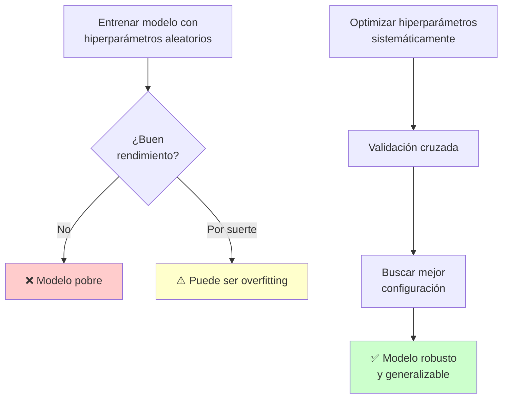

---

## Parámetros vs Hiperparámetros

### Definiciones

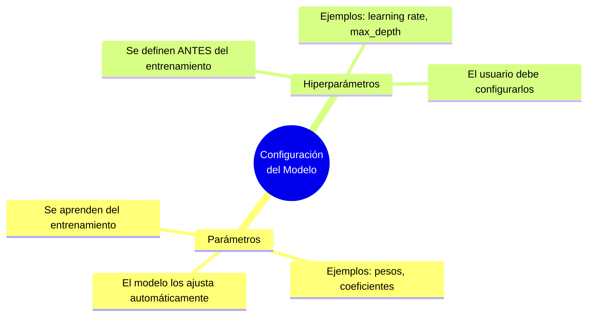

---

### Comparación Detallada

| Aspecto | Parámetros | Hiperparámetros |
|---------|-----------|-----------------|
| **Definición** | Variables **internas** del modelo que se aprenden durante el entrenamiento | Variables **externas** que controlan el proceso de aprendizaje |
| **Cómo se obtienen** | El algoritmo los **ajusta automáticamente** usando los datos | El usuario debe **especificarlos manualmente** |
| **¿Cuándo se definen?** | **Durante** el entrenamiento | **Antes** del entrenamiento |
| **Ejemplos** | Pesos de red neuronal, coeficientes de regresión, vectores de soporte en SVM | Learning rate, número de árboles, profundidad máxima, C en SVM |
| **¿Se guardan en el modelo?** | ✅ Sí | ⚠️ Se guardan pero como configuración |
| **¿Se pueden modificar después?** | ❌ No sin reentrenar | ✅ Sí, pero requiere reentrenar |

---

### Ejemplos por Algoritmo

#### 1. Regresión Lineal

```python
from sklearn.linear_model import Ridge

# Crear modelo
model = Ridge(alpha=1.0)  # alpha es un HIPERPARÁMETRO
model.fit(X_train, y_train)

# Los coeficientes son PARÁMETROS (aprendidos)
print("Parámetros (coeficientes):", model.coef_)
print("Parámetro (intercepto):", model.intercept_)
```

**Tabla de Parámetros vs Hiperparámetros**:

| Tipo | Nombre | Descripción |
|------|--------|-------------|
| **Hiperparámetro** | `alpha` | Fuerza de regularización (lo defines tú) |
| **Parámetro** | `coef_` | Pesos de cada característica (aprendidos) |
| **Parámetro** | `intercept_` | Término independiente (aprendido) |

---

#### 2. Random Forest

```python
from sklearn.ensemble import RandomForestClassifier

# Crear modelo con HIPERPARÁMETROS
model = RandomForestClassifier(
    n_estimators=100,        # Hiperparámetro
    max_depth=10,           # Hiperparámetro
    min_samples_split=5,    # Hiperparámetro
    random_state=42
)

model.fit(X_train, y_train)

# Los árboles internos son PARÁMETROS (aprendidos)
# Cada nodo de cada árbol tiene condiciones aprendidas
```

**Hiperparámetros comunes**:

| Hiperparámetro | Qué Controla | Valores Típicos |
|----------------|--------------|-----------------|
| `n_estimators` | Número de árboles | 50, 100, 200, 500 |
| `max_depth` | Profundidad máxima de árboles | 5, 10, 20, None |
| `min_samples_split` | Mínimo de muestras para dividir | 2, 5, 10 |
| `min_samples_leaf` | Mínimo de muestras en hoja | 1, 2, 4 |
| `max_features` | Features a considerar en cada split | 'sqrt', 'log2', None |

---

#### 3. Red Neuronal

```python
from sklearn.neural_network import MLPClassifier

# HIPERPARÁMETROS de arquitectura y entrenamiento
model = MLPClassifier(
    hidden_layer_sizes=(100, 50),  # Hiperparámetro: arquitectura
    activation='relu',             # Hiperparámetro: función de activación
    learning_rate_init=0.001,      # Hiperparámetro: tasa de aprendizaje
    max_iter=200,                  # Hiperparámetro: épocas
    random_state=42
)

model.fit(X_train, y_train)

# PARÁMETROS (pesos y sesgos de cada capa)
print("Capas:", len(model.coefs_))  # Número de capas
print("Pesos capa 1:", model.coefs_[0].shape)
print("Sesgos capa 1:", model.intercepts_[0].shape)
```

---

### Visualización del Proceso

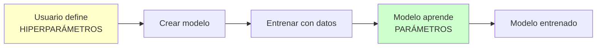

**Ejemplo Conceptual**:

```
🎯 HIPERPARÁMETROS (tú decides):
   - Profundidad del árbol: 10
   - Número de árboles: 100
   - Mínimo de muestras: 5

       ⬇ ENTRENAR ⬇

📊 PARÁMETROS (el modelo aprende):
   - Árbol 1: Si edad > 35 → Si salario > 50k → Clase A
   - Árbol 2: Si ciudad == "NYC" → Si edad < 25 → Clase B
   - ... (98 árboles más con sus reglas)
```

---

### ¿Por qué importa esta distinción?

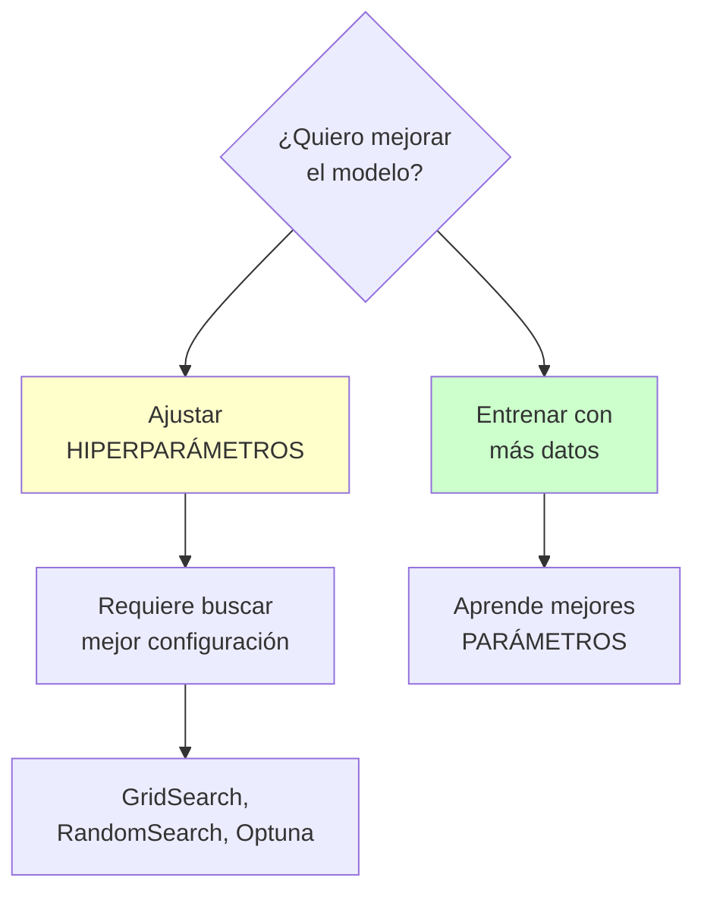

| Objetivo | Acción |
|----------|--------|
| **Reducir overfitting** | Ajustar hiperparámetros de regularización (`alpha`, `max_depth`) |
| **Mejorar precisión** | Buscar mejores hiperparámetros con validación cruzada |
| **Acelerar entrenamiento** | Ajustar `learning_rate`, `batch_size` |
| **Modelo más simple** | Reducir `n_estimators`, `hidden_layers` |

---

## Validación Cruzada (Cross-Validation)

### ¿Por qué NO basta con Train/Test Split?

```python
# ❌ PROBLEMA: Split simple
X_train, X_test, y_train, y_test = train_test_split(X, y, test_size=0.2)

model.fit(X_train, y_train)
score = model.score(X_test, y_test)
```

**Problemas**:

1. ⚠️ El resultado depende de la **suerte** del split
2. ⚠️ 20% de datos "desperdiciados" (solo para test)
3. ⚠️ No sabes si el modelo **generaliza bien** o tuvo suerte

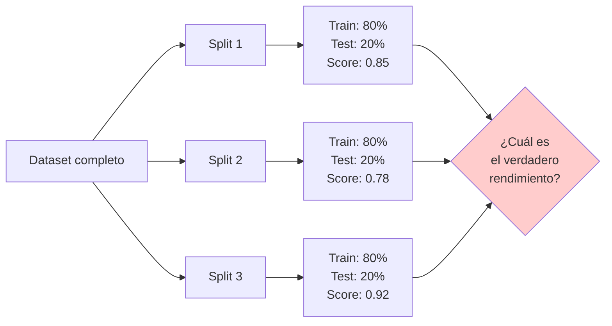

---

### Solución: Validación Cruzada

**Concepto**: Dividir los datos en **múltiples particiones** (folds) y usar cada partición como test una vez.

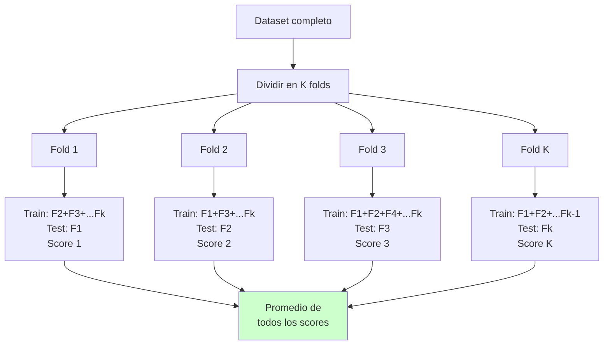

**Ventajas**:

✅ Usa **todos los datos** para entrenamiento y validación
✅ Resultados más **confiables** (promedio de K experimentos)
✅ Detecta **overfitting** si hay gran varianza entre folds

---

### Tipos de Validación Cruzada

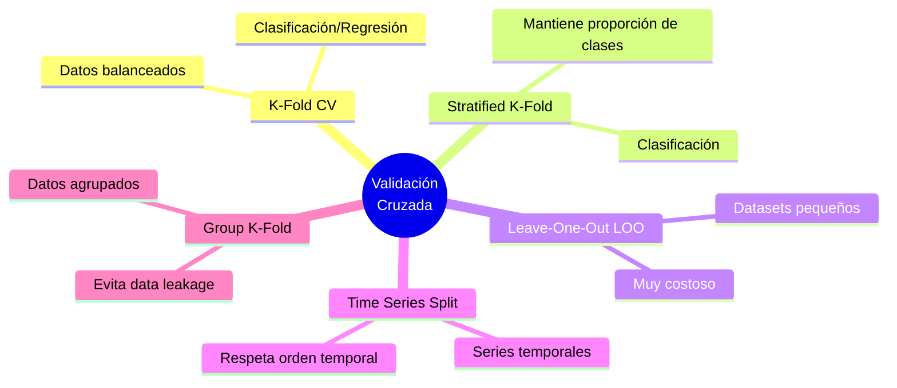

---

### 1. K-Fold Cross-Validation

**Concepto**: Divide datos en K particiones iguales. Cada partición se usa como test una vez.

#### Visualización

```
Dataset: [■■■■■■■■■■■■■■■■■■■■] (100 muestras)

K=5 folds:

Iteración 1: [████|····|····|····|····]  Test: 20 muestras
             Train ---------> (80 muestras)

Iteración 2: [····|████|····|····|····]  Test: 20 muestras
              ----  Train ---------> (80 muestras)

Iteración 3: [····|····|████|····|····]  Test: 20 muestras
              --------  Train --> (80 muestras)

Iteración 4: [····|····|····|████|····]  Test: 20 muestras
              ----------  Train --> (80 muestras)

Iteración 5: [····|····|····|····|████]  Test: 20 muestras
              ----------  Train --> (80 muestras)

Resultado: Promedio de 5 scores
```

#### Código con scikit-learn

```python
from sklearn.model_selection import cross_val_score, KFold
from sklearn.ensemble import RandomForestClassifier

# Crear modelo
model = RandomForestClassifier(n_estimators=100)

# K-Fold con 5 particiones
kfold = KFold(n_splits=5, shuffle=True, random_state=42)

# Realizar validación cruzada
scores = cross_val_score(model, X, y, cv=kfold, scoring='accuracy')

print(f"Scores por fold: {scores}")
print(f"Accuracy promedio: {scores.mean():.3f} (+/- {scores.std():.3f})")

# Ejemplo de salida:
# Scores por fold: [0.85, 0.82, 0.88, 0.84, 0.86]
# Accuracy promedio: 0.850 (+/- 0.021)
```

#### Parámetros de KFold

| Parámetro | Descripción | Valores Comunes |
|-----------|-------------|-----------------|
| `n_splits` | Número de folds (K) | 5, 10 |
| `shuffle` | Mezclar datos antes de dividir | `True` (recomendado) |
| `random_state` | Semilla para reproducibilidad | 42, 0 |

---

### 2. Stratified K-Fold

**Problema con K-Fold regular**: En clasificación desbalanceada, algunos folds pueden no tener muestras de ciertas clases.

```
Dataset desbalanceado: 90% Clase A, 10% Clase B

❌ K-Fold regular puede crear:
   Fold 1: 100% Clase A (sin Clase B)
   Fold 2: 95% Clase A, 5% Clase B
   ...

✅ Stratified K-Fold mantiene proporciones:
   Fold 1: 90% Clase A, 10% Clase B
   Fold 2: 90% Clase A, 10% Clase B
   ...
```

#### Visualización

```
Dataset Original:
Clase A: ████████████████████████████████████████ (90%)
Clase B: ████ (10%)

Stratified K-Fold (K=5):
┌──────────────────────────────────────┐
│ Fold 1: 90% A + 10% B                │
│ Fold 2: 90% A + 10% B                │
│ Fold 3: 90% A + 10% B                │
│ Fold 4: 90% A + 10% B                │
│ Fold 5: 90% A + 10% B                │
└──────────────────────────────────────┘
```

#### Código con scikit-learn

```python
from sklearn.model_selection import StratifiedKFold, cross_val_score

# Crear modelo
model = RandomForestClassifier(n_estimators=100)

# Stratified K-Fold
stratified_kfold = StratifiedKFold(n_splits=5, shuffle=True, random_state=42)

# Validación cruzada estratificada
scores = cross_val_score(model, X, y, cv=stratified_kfold, scoring='accuracy')

print(f"Scores por fold: {scores}")
print(f"Accuracy promedio: {scores.mean():.3f}")
```

#### Cuándo Usar

| Usar Stratified K-Fold | Usar K-Fold Regular |
|------------------------|---------------------|
| ✅ Clasificación | ✅ Regresión |
| ✅ Clases desbalanceadas | ✅ Clases balanceadas |
| ✅ Pocas muestras por clase | - |

---

### 3. Leave-One-Out (LOO)

**Concepto**: Caso extremo de K-Fold donde **K = número de muestras**. Cada muestra es un fold.

```
Dataset: 10 muestras [1, 2, 3, 4, 5, 6, 7, 8, 9, 10]

Iteración 1:  Test: [1]    Train: [2,3,4,5,6,7,8,9,10]
Iteración 2:  Test: [2]    Train: [1,3,4,5,6,7,8,9,10]
Iteración 3:  Test: [3]    Train: [1,2,4,5,6,7,8,9,10]
...
Iteración 10: Test: [10]   Train: [1,2,3,4,5,6,7,8,9]

Total: 10 modelos entrenados
```

#### Código con scikit-learn

```python
from sklearn.model_selection import LeaveOneOut, cross_val_score

# Crear modelo
model = RandomForestClassifier(n_estimators=50)

# Leave-One-Out
loo = LeaveOneOut()

# Validación cruzada (¡LENTO para datasets grandes!)
scores = cross_val_score(model, X, y, cv=loo)

print(f"Número de iteraciones: {len(scores)}")  # = número de muestras
print(f"Accuracy promedio: {scores.mean():.3f}")
```

#### Ventajas y Desventajas

| ✅ Ventajas | ❌ Desventajas |
|------------|----------------|
| Usa TODOS los datos | **MUY lento** (n entrenamientos) |
| Sin sesgo por split | Alta varianza en resultados |
| Máxima utilización de datos | No práctico para datasets grandes |

**Cuándo usar**: Solo con **datasets muy pequeños** (< 100 muestras).

---

### 4. Time Series Split

**Problema**: Con series temporales, **NO puedes mezclar los datos**. El futuro no puede predecir el pasado.

```
❌ K-Fold regular (mezcla datos):
[Ene, Feb, Mar, Abr, May, Jun, Jul, Ago, Sep, Oct, Nov, Dic]
Fold 1: Train [Ene, Mar, May, Jul, Sep, Nov]  Test [Feb, Abr, Jun, Ago, Oct, Dic]
                     ↑ Usa datos del futuro para predecir el pasado ❌

✅ Time Series Split (respeta orden):
[Ene, Feb, Mar, Abr, May, Jun, Jul, Ago, Sep, Oct, Nov, Dic]
Fold 1: Train [Ene, Feb, Mar]          Test [Abr]
Fold 2: Train [Ene, Feb, Mar, Abr]     Test [May]
Fold 3: Train [Ene, ..., May]          Test [Jun]
...
```

#### Visualización

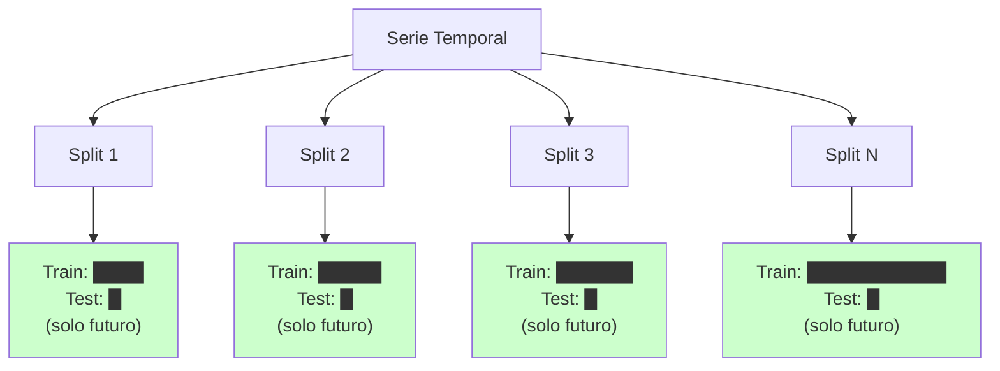

#### Código con scikit-learn

```python
from sklearn.model_selection import TimeSeriesSplit, cross_val_score

# Crear modelo
model = RandomForestRegressor()

# Time Series Split con 5 splits
tscv = TimeSeriesSplit(n_splits=5)

# Validación cruzada temporal
scores = cross_val_score(model, X, y, cv=tscv, scoring='neg_mean_squared_error')

print(f"MSE por split: {-scores}")  # Negativo porque scoring es 'neg_mse'
print(f"MSE promedio: {-scores.mean():.3f}")

# Visualizar los splits
for i, (train_index, test_index) in enumerate(tscv.split(X)):
    print(f"Split {i+1}:")
    print(f"  Train: índices {train_index[0]} a {train_index[-1]}")
    print(f"  Test:  índices {test_index[0]} a {test_index[-1]}")
```

---

### 5. Group K-Fold

**Problema**: Cuando tienes **grupos** en tus datos (ej: múltiples mediciones del mismo paciente), debes asegurar que muestras del mismo grupo NO estén en train y test simultáneamente.

```
Dataset: Pacientes con múltiples visitas

❌ K-Fold regular:
   Paciente A: Visita 1 (Train), Visita 2 (Test)  ← Data leakage!

✅ Group K-Fold:
   Paciente A: Todas sus visitas en Train
   Paciente B: Todas sus visitas en Test
```

#### Código con scikit-learn

```python
from sklearn.model_selection import GroupKFold

# IDs de grupo (ej: ID de paciente)
groups = [1, 1, 1, 2, 2, 3, 3, 3, 4, 4]
#         └─A─┘  └B┘  └─C─┘  └D┘

# Group K-Fold
gkf = GroupKFold(n_splits=3)

for i, (train_idx, test_idx) in enumerate(gkf.split(X, y, groups=groups)):
    print(f"Fold {i+1}:")
    print(f"  Train groups: {set([groups[i] for i in train_idx])}")
    print(f"  Test groups:  {set([groups[i] for i in test_idx])}")

# Salida:
# Fold 1:
#   Train groups: {2, 3, 4}
#   Test groups:  {1}
```

---

### Comparación de Métodos de Validación

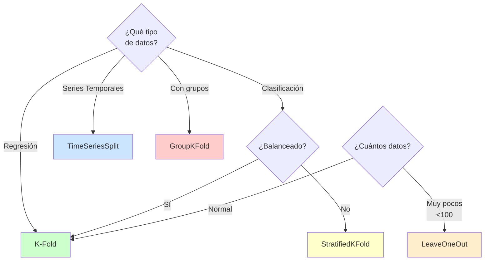

### Tabla Comparativa Completa

| Método | Tipo de Datos | Ventajas | Desventajas | Cuándo Usar |
|--------|---------------|----------|-------------|-------------|
| **K-Fold** | Regresión, Clasificación balanceada | Simple, eficiente | Puede desbalancear clases | General purpose |
| **Stratified K-Fold** | Clasificación | Mantiene proporción de clases | Solo para clasificación | Clases desbalanceadas |
| **Leave-One-Out** | Cualquiera | Máximo uso de datos | Muy lento, alta varianza | Datasets muy pequeños |
| **Time Series Split** | Series temporales | Respeta temporalidad | Requiere orden | Forecasting, finanzas |
| **Group K-Fold** | Datos agrupados | Evita data leakage | Requiere definir grupos | Múltiples mediciones |

---

## Optimización de Hiperparámetros con scikit-learn

### Flujo General

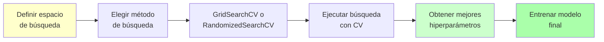

---

### 1. GridSearchCV (Búsqueda Exhaustiva)

**Concepto**: Prueba **todas las combinaciones posibles** de hiperparámetros.

#### ¿Cómo Funciona?

```
Espacio de búsqueda:
- n_estimators: [50, 100, 200]
- max_depth: [5, 10, 15]
- min_samples_split: [2, 5]

Grid completo:
┌────────────────────────────────────────────────┐
│ Combinación 1: n=50,  d=5,  s=2                │
│ Combinación 2: n=50,  d=5,  s=5                │
│ Combinación 3: n=50,  d=10, s=2                │
│ Combinación 4: n=50,  d=10, s=5                │
│ Combinación 5: n=50,  d=15, s=2                │
│ Combinación 6: n=50,  d=15, s=5                │
│ Combinación 7: n=100, d=5,  s=2                │
│ ... (18 combinaciones en total = 3×3×2)        │
└────────────────────────────────────────────────┘

Cada combinación se evalúa con K-Fold CV (ej: K=5)
Total de entrenamientos: 18 × 5 = 90
```

#### Código con scikit-learn

```python
from sklearn.model_selection import GridSearchCV
from sklearn.ensemble import RandomForestClassifier

# 1. Definir modelo base
model = RandomForestClassifier(random_state=42)

# 2. Definir espacio de búsqueda (grid)
param_grid = {
    'n_estimators': [50, 100, 200],
    'max_depth': [5, 10, 15, None],
    'min_samples_split': [2, 5, 10],
    'min_samples_leaf': [1, 2, 4]
}

# 3. Crear GridSearchCV
grid_search = GridSearchCV(
    estimator=model,
    param_grid=param_grid,
    cv=5,                    # 5-fold cross-validation
    scoring='accuracy',      # Métrica a optimizar
    n_jobs=-1,              # Usar todos los CPUs
    verbose=2                # Mostrar progreso
)

# 4. Ejecutar búsqueda
grid_search.fit(X_train, y_train)

# 5. Mejores hiperparámetros
print("Mejores hiperparámetros:", grid_search.best_params_)
print("Mejor score:", grid_search.best_score_)

# 6. Usar mejor modelo
best_model = grid_search.best_estimator_
predictions = best_model.predict(X_test)

# Ejemplo de salida:
# Mejores hiperparámetros: {'max_depth': 10, 'min_samples_leaf': 1,
#                            'min_samples_split': 2, 'n_estimators': 200}
# Mejor score: 0.8765
```

#### Analizar Resultados

```python
import pandas as pd

# Ver todos los resultados
results = pd.DataFrame(grid_search.cv_results_)

# Columnas importantes
results[['params', 'mean_test_score', 'std_test_score', 'rank_test_score']].sort_values('rank_test_score')

# Top 5 configuraciones
print(results.nsmallest(5, 'rank_test_score')[['params', 'mean_test_score']])
```

#### Ventajas y Desventajas

| ✅ Ventajas | ❌ Desventajas |
|------------|----------------|
| Prueba TODAS las combinaciones | **Muy lento** con muchos hiperparámetros |
| Garantiza encontrar el mejor dentro del grid | Crece exponencialmente |
| Reproducible | No escala bien |
| Simple de entender | Puede no explorar bien el espacio |

**Complejidad**: Si tienes **n** hiperparámetros con **m** valores cada uno:
- Combinaciones: $m^n$
- Con K-Fold CV: $m^n \times K$ entrenamientos

Ejemplo: 5 hiperparámetros con 4 valores = $4^5 = 1024$ combinaciones × 5 folds = **5,120 entrenamientos** 😱

---

### 2. RandomizedSearchCV (Búsqueda Aleatoria)

**Concepto**: En lugar de probar TODAS las combinaciones, prueba un **número fijo de combinaciones aleatorias**.

#### Comparación Visual

```
GridSearchCV (exhaustivo):
┌───┬───┬───┬───┬───┐
│ ✓ │ ✓ │ ✓ │ ✓ │ ✓ │  Prueba TODAS
│ ✓ │ ✓ │ ✓ │ ✓ │ ✓ │  las celdas
│ ✓ │ ✓ │ ✓ │ ✓ │ ✓ │  (25 combinaciones)
│ ✓ │ ✓ │ ✓ │ ✓ │ ✓ │
│ ✓ │ ✓ │ ✓ │ ✓ │ ✓ │
└───┴───┴───┴───┴───┘

RandomizedSearchCV (muestreo):
┌───┬───┬───┬───┬───┐
│   │ ✓ │   │   │ ✓ │  Prueba solo n_iter
│ ✓ │   │   │ ✓ │   │  combinaciones aleatorias
│   │   │ ✓ │   │   │  (10 combinaciones)
│   │ ✓ │   │   │ ✓ │
│ ✓ │   │   │ ✓ │   │
└───┴───┴───┴───┴───┘
Más rápido pero puede perder el óptimo global
```

#### Código con scikit-learn

```python
from sklearn.model_selection import RandomizedSearchCV
from scipy.stats import randint, uniform

# 1. Definir modelo
model = RandomForestClassifier(random_state=42)

# 2. Definir distribuciones de hiperparámetros
param_distributions = {
    'n_estimators': randint(50, 500),           # Enteros entre 50-500
    'max_depth': randint(5, 50),                # Enteros entre 5-50
    'min_samples_split': randint(2, 20),        # Enteros entre 2-20
    'min_samples_leaf': randint(1, 10),         # Enteros entre 1-10
    'max_features': uniform(0.1, 0.9)           # Floats entre 0.1-1.0
}

# 3. Crear RandomizedSearchCV
random_search = RandomizedSearchCV(
    estimator=model,
    param_distributions=param_distributions,
    n_iter=50,               # Número de combinaciones a probar
    cv=5,
    scoring='accuracy',
    n_jobs=-1,
    random_state=42,
    verbose=2
)

# 4. Ejecutar búsqueda
random_search.fit(X_train, y_train)

# 5. Mejores hiperparámetros
print("Mejores hiperparámetros:", random_search.best_params_)
print("Mejor score:", random_search.best_score_)
```

#### Distribuciones Comunes

| Distribución | Uso | Ejemplo |
|--------------|-----|---------|
| `randint(low, high)` | Enteros discretos | `n_estimators`, `max_depth` |
| `uniform(low, width)` | Floats continuos | `learning_rate`, `alpha` |
| `loguniform(low, high)` | Floats en escala logarítmica | `C` en SVM, regularización |
| Lista | Categóricos | `['gini', 'entropy']` |

```python
from scipy.stats import randint, uniform, loguniform

param_dist = {
    # Entero: 10-100
    'n_estimators': randint(10, 100),

    # Float lineal: 0.0-1.0
    'subsample': uniform(0.5, 0.5),  # uniform(loc, scale) → [0.5, 1.0]

    # Float logarítmico: 0.0001-0.1
    'learning_rate': loguniform(1e-4, 1e-1),

    # Categórico
    'criterion': ['gini', 'entropy']
}
```

#### Ventajas y Desventajas

| ✅ Ventajas | ❌ Desventajas |
|------------|----------------|
| **Mucho más rápido** que GridSearch | No garantiza encontrar el óptimo |
| Explora mejor espacios continuos | Puede repetir combinaciones |
| Puedes controlar el tiempo (n_iter) | Requiere entender distribuciones |
| Bueno para muchos hiperparámetros | Menos reproducible |

**Cuándo usar**: Espacio de búsqueda **grande** o hiperparámetros **continuos**.

---

### 3. HalvingGridSearchCV / HalvingRandomSearchCV

**Concepto**: Variante **eficiente** que elimina candidatos pobres progresivamente usando **Successive Halving**.

#### ¿Cómo Funciona?

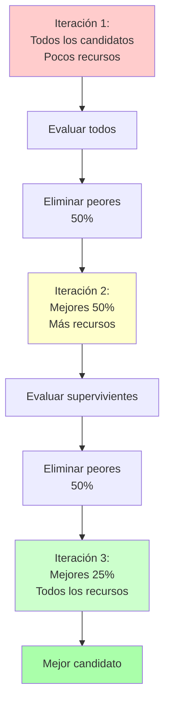

#### Ejemplo Visual

```
64 candidatos iniciales
├─ Iteración 1: Entrenar con 100 muestras
│  └─ Eliminar 32 peores → Quedan 32
│
├─ Iteración 2: Entrenar con 400 muestras
│  └─ Eliminar 16 peores → Quedan 16
│
├─ Iteración 3: Entrenar con 1600 muestras
│  └─ Eliminar 8 peores → Quedan 8
│
└─ Iteración 4: Entrenar con 6400 muestras
   └─ Elegir el mejor

✅ Ahorro: ~75% de entrenamientos vs GridSearch
```

#### Código con scikit-learn

```python
from sklearn.experimental import enable_halving_search_cv  # ¡Necesario!
from sklearn.model_selection import HalvingGridSearchCV

# Definir modelo y param_grid igual que GridSearchCV
model = RandomForestClassifier(random_state=42)

param_grid = {
    'n_estimators': [50, 100, 200, 500],
    'max_depth': [5, 10, 15, 20, None],
    'min_samples_split': [2, 5, 10]
}

# HalvingGridSearchCV
halving_search = HalvingGridSearchCV(
    estimator=model,
    param_grid=param_grid,
    factor=3,                # Factor de reducción (elimina 2/3 en cada iter)
    resource='n_samples',    # Recurso a aumentar: muestras o n_estimators
    max_resources='auto',    # Máximo de recursos disponibles
    cv=5,
    random_state=42,
    verbose=1
)

halving_search.fit(X_train, y_train)

print("Mejores hiperparámetros:", halving_search.best_params_)
```

#### Parámetros Importantes

| Parámetro | Descripción | Valores |
|-----------|-------------|---------|
| `factor` | Factor de eliminación | 2, 3 (elimina 1/2 o 2/3) |
| `resource` | Qué aumentar en cada iter | `'n_samples'`, `'n_estimators'` |
| `max_resources` | Máximo de recursos | `'auto'` o número |
| `aggressive_elimination` | Forzar factor en última iter | `True`, `False` |

---

### Comparación: Grid vs Randomized vs Halving

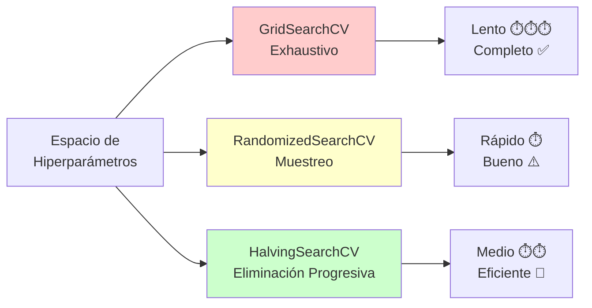

### Tabla Comparativa

| Método | Velocidad | Cobertura | Mejor Para | Complejidad |
|--------|-----------|-----------|------------|-------------|
| **GridSearchCV** | ⏱️⏱️⏱️ Muy lento | ✅ 100% del grid | Espacios pequeños, pocos hiper | 🟢 Simple |
| **RandomizedSearchCV** | ⏱️⏱️ Rápido | ⚠️ Muestreo aleatorio | Espacios grandes, continuos | 🟡 Media |
| **HalvingGridSearchCV** | ⏱️⏱️ Medio | ✅ 100% del grid (eficiente) | Espacios medianos | 🟡 Media |
| **HalvingRandomSearchCV** | ⏱️ Muy rápido | ⚠️ Muestreo aleatorio (eficiente) | Espacios muy grandes | 🟡 Media |

### Ejemplo de Tiempos

```
Dataset: 10,000 muestras
Hiperparámetros: 5 parámetros con 4 valores cada uno = 1024 combinaciones
K-Fold: 5 folds

GridSearchCV:        1024 × 5 = 5,120 entrenamientos  (~8 horas)
RandomizedSearchCV:   100 × 5 =   500 entrenamientos  (~50 min)
HalvingGridSearchCV:  ~300 × 5 = 1,500 entrenamientos (~2.5 horas)
```

---

## Optimización Avanzada con Optuna

### ¿Qué es Optuna?

**Optuna** es un framework de optimización de hiperparámetros que usa **algoritmos inteligentes** para encontrar mejores configuraciones **más rápido** que Grid/Random Search.

### Grid/Random Search vs Optuna

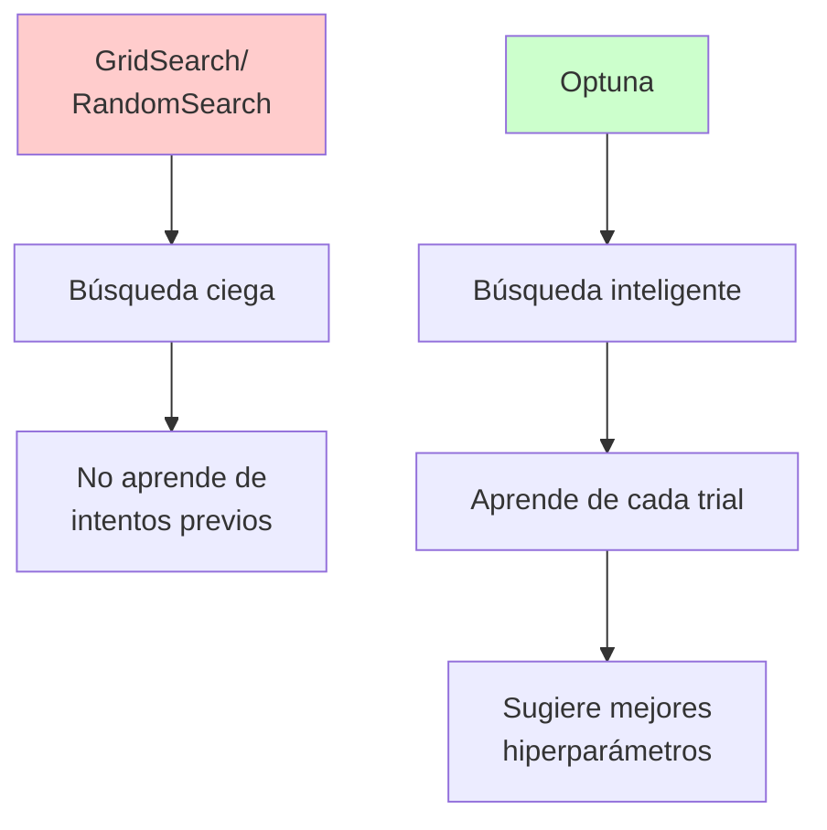

### Diferencias Clave

| Aspecto | GridSearch/RandomSearch | Optuna |
|---------|------------------------|--------|
| **Estrategia** | Búsqueda ciega (no aprende) | Búsqueda bayesiana (aprende) |
| **Eficiencia** | Muchas evaluaciones desperdiciadas | Menos evaluaciones necesarias |
| **Flexibilidad** | Grid estático | Espacio dinámico |
| **Algoritmo** | Fuerza bruta / Aleatorio | Tree-structured Parzen Estimator (TPE) |
| **Early Stopping** | ❌ No soportado | ✅ Pruning de trials pobres |
| **Distribuciones** | Listas fijas | Continuas, categóricas, log-uniform |

---

### Conceptos Básicos de Optuna

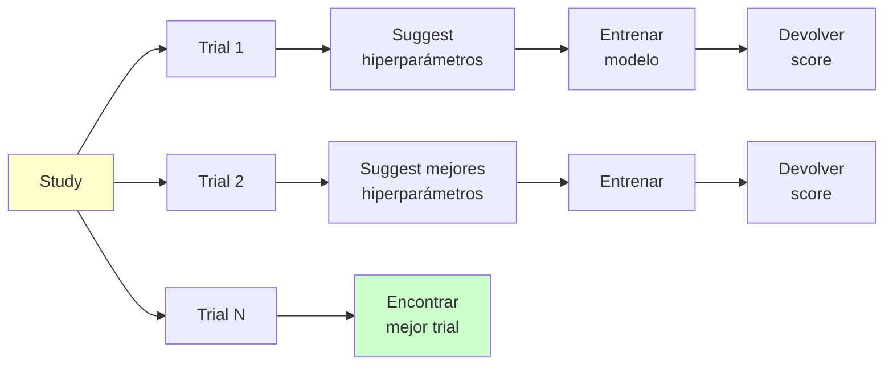

**Terminología**:

| Término | Definición |
|---------|------------|
| **Study** | Proceso de optimización completo |
| **Trial** | Una evaluación individual (un set de hiperparámetros) |
| **Objective Function** | Función que entrena el modelo y devuelve score |
| **Suggest** | Método para proponer valores de hiperparámetros |
| **Sampler** | Algoritmo que sugiere valores (TPE, Random, CMA-ES) |
| **Pruner** | Detiene trials pobres tempranamente |

---

### Ejemplo Básico con Optuna

```python
import optuna
from sklearn.ensemble import RandomForestClassifier
from sklearn.model_selection import cross_val_score
from sklearn.datasets import load_iris

# 1. Cargar datos
X, y = load_iris(return_X_y=True)

# 2. Definir función objetivo
def objective(trial):
    # Sugerir hiperparámetros
    n_estimators = trial.suggest_int('n_estimators', 50, 500)
    max_depth = trial.suggest_int('max_depth', 2, 32)
    min_samples_split = trial.suggest_int('min_samples_split', 2, 20)
    min_samples_leaf = trial.suggest_int('min_samples_leaf', 1, 10)

    # Crear modelo con hiperparámetros sugeridos
    model = RandomForestClassifier(
        n_estimators=n_estimators,
        max_depth=max_depth,
        min_samples_split=min_samples_split,
        min_samples_leaf=min_samples_leaf,
        random_state=42
    )

    # Evaluar con cross-validation
    score = cross_val_score(model, X, y, cv=5, scoring='accuracy').mean()

    return score  # Optuna MAXIMIZA o MINIMIZA este valor

# 3. Crear study
study = optuna.create_study(direction='maximize')  # Maximizar accuracy

# 4. Optimizar
study.optimize(objective, n_trials=100)

# 5. Mejores hiperparámetros
print("Mejores hiperparámetros:", study.best_params)
print("Mejor score:", study.best_value)
print("Mejor trial:", study.best_trial)

# Ejemplo de salida:
# Mejores hiperparámetros: {'n_estimators': 324, 'max_depth': 18,
#                            'min_samples_split': 3, 'min_samples_leaf': 2}
# Mejor score: 0.9733
```

---

### Tipos de Suggest

#### 1. Suggest Integer

```python
def objective(trial):
    # Entero uniforme
    n_estimators = trial.suggest_int('n_estimators', 10, 1000)

    # Entero logarítmico (útil para búsqueda exponencial)
    n_estimators_log = trial.suggest_int('n_estimators', 10, 1000, log=True)

    # Entero con step
    batch_size = trial.suggest_int('batch_size', 16, 256, step=16)
    # Valores posibles: 16, 32, 48, 64, ..., 256
```

#### 2. Suggest Float

```python
def objective(trial):
    # Float uniforme
    learning_rate = trial.suggest_float('learning_rate', 0.0001, 0.1)

    # Float logarítmico (para learning rates, regularización)
    lr_log = trial.suggest_float('lr', 1e-5, 1e-1, log=True)

    # Float con step
    dropout = trial.suggest_float('dropout', 0.1, 0.9, step=0.1)
    # Valores: 0.1, 0.2, 0.3, ..., 0.9
```

#### 3. Suggest Categorical

```python
def objective(trial):
    # Categórico (para opciones discretas)
    optimizer = trial.suggest_categorical('optimizer', ['adam', 'sgd', 'rmsprop'])

    activation = trial.suggest_categorical('activation', ['relu', 'tanh', 'sigmoid'])

    kernel = trial.suggest_categorical('kernel', ['linear', 'rbf', 'poly'])
```

---

### Ejemplo Avanzado: Multiple Modelos

```python
import optuna
from sklearn.svm import SVC
from sklearn.ensemble import RandomForestClassifier
from sklearn.linear_model import LogisticRegression

def objective(trial):
    # Sugerir qué modelo usar
    classifier_name = trial.suggest_categorical('classifier', ['SVC', 'RandomForest', 'LogisticRegression'])

    if classifier_name == 'SVC':
        # Hiperparámetros específicos de SVC
        C = trial.suggest_float('svc_C', 1e-3, 1e3, log=True)
        kernel = trial.suggest_categorical('svc_kernel', ['linear', 'rbf', 'poly'])

        if kernel == 'rbf' or kernel == 'poly':
            gamma = trial.suggest_float('svc_gamma', 1e-4, 1e-1, log=True)
            classifier = SVC(C=C, kernel=kernel, gamma=gamma, random_state=42)
        else:
            classifier = SVC(C=C, kernel=kernel, random_state=42)

    elif classifier_name == 'RandomForest':
        # Hiperparámetros de Random Forest
        n_estimators = trial.suggest_int('rf_n_estimators', 50, 500)
        max_depth = trial.suggest_int('rf_max_depth', 2, 32)
        classifier = RandomForestClassifier(
            n_estimators=n_estimators,
            max_depth=max_depth,
            random_state=42
        )

    else:  # LogisticRegression
        C = trial.suggest_float('lr_C', 1e-3, 1e3, log=True)
        classifier = LogisticRegression(C=C, random_state=42, max_iter=1000)

    # Evaluar
    score = cross_val_score(classifier, X, y, cv=5, scoring='accuracy').mean()
    return score

study = optuna.create_study(direction='maximize')
study.optimize(objective, n_trials=200)

print("Mejor modelo:", study.best_params['classifier'])
print("Mejores hiperparámetros:", study.best_params)
```

---

### Pruning: Detener Trials Pobres

**Concepto**: Si un trial está dando malos resultados en las primeras épocas/folds, **detenerlo temprano** para ahorrar tiempo.

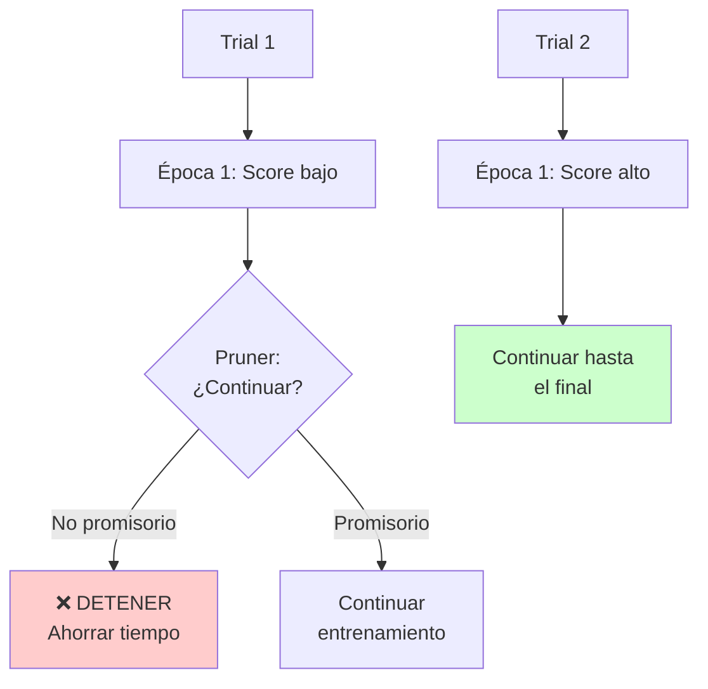

#### Código con Pruning

```python
import optuna
from sklearn.ensemble import GradientBoostingClassifier
from sklearn.model_selection import cross_validate

def objective(trial):
    # Sugerir hiperparámetros
    n_estimators = trial.suggest_int('n_estimators', 50, 500)
    learning_rate = trial.suggest_float('learning_rate', 0.01, 0.3, log=True)
    max_depth = trial.suggest_int('max_depth', 3, 10)

    model = GradientBoostingClassifier(
        n_estimators=n_estimators,
        learning_rate=learning_rate,
        max_depth=max_depth,
        random_state=42
    )

    # Cross-validation con reporte de scores intermedios
    cv_results = cross_validate(model, X, y, cv=5, scoring='accuracy', return_train_score=False)

    # Reportar score de cada fold para pruning
    for i, score in enumerate(cv_results['test_score']):
        # Report intermediate value
        trial.report(score, i)

        # Check if trial should be pruned
        if trial.should_prune():
            raise optuna.TrialPruned()

    return cv_results['test_score'].mean()

# Study con pruner
study = optuna.create_study(
    direction='maximize',
    pruner=optuna.pruners.MedianPruner(  # Detiene si score < mediana
        n_startup_trials=10,  # No prunar los primeros 10 trials
        n_warmup_steps=2      # No prunar en los primeros 2 folds
    )
)

study.optimize(objective, n_trials=100)

print(f"Trials completados: {len([t for t in study.trials if t.state == optuna.trial.TrialState.COMPLETE])}")
print(f"Trials podados: {len([t for t in study.trials if t.state == optuna.trial.TrialState.PRUNED])}")
```

#### Tipos de Pruners

| Pruner | Descripción | Cuándo Usar |
|--------|-------------|-------------|
| **MedianPruner** | Poda si score < mediana de otros trials | General purpose |
| **PercentilePruner** | Poda si score < percentil X | Control fino |
| **HyperbandPruner** | Successive Halving avanzado | Muchos hiperparámetros |
| **ThresholdPruner** | Poda si score < umbral fijo | Requisito mínimo conocido |

---

### Visualización de Resultados

Optuna incluye herramientas de visualización muy útiles:

```python
import optuna.visualization as vis

# 1. Historia de optimización
fig = vis.plot_optimization_history(study)
fig.show()

# 2. Importancia de hiperparámetros
fig = vis.plot_param_importances(study)
fig.show()

# 3. Slice plot (efecto individual de cada hiperparámetro)
fig = vis.plot_slice(study)
fig.show()

# 4. Contour plot (interacción entre 2 hiperparámetros)
fig = vis.plot_contour(study, params=['n_estimators', 'max_depth'])
fig.show()

# 5. Parallel coordinate plot
fig = vis.plot_parallel_coordinate(study)
fig.show()
```

---

### Integración con scikit-learn

Optuna tiene una integración directa con scikit-learn:

```python
import optuna
from optuna.integration import OptunaSearchCV
from sklearn.ensemble import RandomForestClassifier

# Similar a GridSearchCV pero con Optuna
param_distributions = {
    'n_estimators': optuna.distributions.IntDistribution(50, 500),
    'max_depth': optuna.distributions.IntDistribution(2, 32),
    'min_samples_split': optuna.distributions.IntDistribution(2, 20)
}

# OptunaSearchCV (API similar a GridSearchCV)
optuna_search = OptunaSearchCV(
    estimator=RandomForestClassifier(random_state=42),
    param_distributions=param_distributions,
    n_trials=100,
    cv=5,
    scoring='accuracy',
    random_state=42
)

optuna_search.fit(X_train, y_train)

print("Mejores hiperparámetros:", optuna_search.best_params_)
print("Mejor score:", optuna_search.best_score_)

# Usar como un modelo normal
predictions = optuna_search.predict(X_test)
```

---

## Comparación de Métodos

### Tabla Comparativa Completa

| Método | Estrategia | Velocidad | Eficiencia | Flexibilidad | Complejidad | Mejor Para |
|--------|-----------|-----------|-----------|--------------|-------------|------------|
| **GridSearchCV** | Exhaustiva | ⏱️⏱️⏱️ | ⭐⭐ | 🔧 | 🟢 Simple | Espacios pequeños, reproducibilidad |
| **RandomizedSearchCV** | Aleatoria | ⏱️⏱️ | ⭐⭐⭐ | 🔧🔧 | 🟢 Simple | Espacios grandes, exploración |
| **HalvingSearchCV** | Eliminación | ⏱️⏱️ | ⭐⭐⭐⭐ | 🔧 | 🟡 Media | Balance velocidad/cobertura |
| **Optuna** | Bayesiana | ⏱️ | ⭐⭐⭐⭐⭐ | 🔧🔧🔧 | 🟡 Media | Espacios complejos, máxima eficiencia |

### Diagrama de Decisión

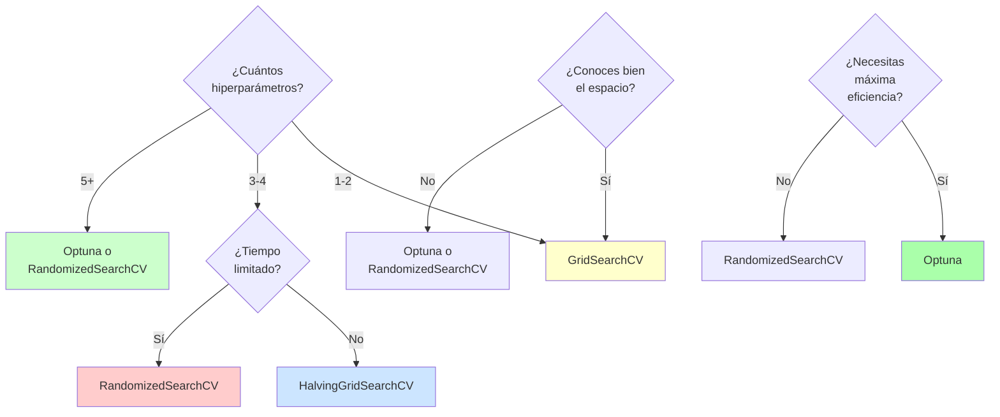

### Ejemplo de Performance

```
Dataset: 50,000 muestras, 100 features
Tarea: Optimizar Random Forest con 5 hiperparámetros
Budget: Encontrar la mejor configuración

┌────────────────────────┬────────────┬──────────────┬────────────┐
│ Método                 │ Tiempo     │ Trials       │ Best Score │
├────────────────────────┼────────────┼──────────────┼────────────┤
│ GridSearchCV           │ 24 horas   │ 1,024 (100%) │   0.8765   │
│ RandomizedSearchCV     │ 2 horas    │   100 (10%)  │   0.8720   │
│ HalvingGridSearchCV    │ 8 horas    │   300 (30%)  │   0.8750   │
│ Optuna (TPE)           │ 1.5 horas  │   150 (15%)  │   0.8780   │ ✅
└────────────────────────┴────────────┴──────────────┴────────────┘

Conclusión: Optuna encontró MEJOR score en MENOS tiempo
```

---

## Mejores Prácticas

### 1. Siempre Usar Validación Cruzada

```python
# ❌ MAL: Sin validación
model.fit(X_train, y_train)
score = model.score(X_test, y_test)  # Solo un número, puede ser suerte

# ✅ BIEN: Con validación cruzada
scores = cross_val_score(model, X_train, y_train, cv=5)
print(f"Score: {scores.mean():.3f} (+/- {scores.std():.3f})")
```

### 2. Separar Test Set ANTES de Optimizar

```python
# ❌ MAL: Test set usado durante optimización
grid_search = GridSearchCV(model, param_grid, cv=5)
grid_search.fit(X, y)  # Usa TODOS los datos
score = grid_search.score(X, y)  # Data leakage!

# ✅ BIEN: Test set separado
X_train, X_test, y_train, y_test = train_test_split(X, y, test_size=0.2)

grid_search = GridSearchCV(model, param_grid, cv=5)
grid_search.fit(X_train, y_train)  # Solo usa train

# Evaluar en test set NO VISTO
test_score = grid_search.score(X_test, y_test)
```

### 3. Definir Rangos Razonables

```python
# ❌ MAL: Rango muy amplio e ineficiente
param_grid = {
    'n_estimators': list(range(1, 1000)),  # 1000 valores!
    'learning_rate': [10**i for i in range(-10, 10)]  # Valores absurdos
}

# ✅ BIEN: Rango enfocado basado en experiencia
param_distributions = {
    'n_estimators': randint(50, 500),
    'learning_rate': loguniform(1e-4, 1e-1)  # Escala log para LR
}
```

### 4. Usar Métricas Apropiadas

```python
# Para clasificación desbalanceada
grid_search = GridSearchCV(
    model, param_grid,
    scoring='f1',  # No usar accuracy si clases desbalanceadas
    cv=StratifiedKFold(5)
)

# Para regresión
grid_search = GridSearchCV(
    model, param_grid,
    scoring='neg_mean_squared_error',
    cv=5
)

# Múltiples métricas
scoring = {
    'accuracy': 'accuracy',
    'precision': 'precision',
    'recall': 'recall',
    'f1': 'f1'
}
grid_search = GridSearchCV(model, param_grid, scoring=scoring, refit='f1')
```

### 5. Guardar Resultados

```python
import joblib

# Guardar mejor modelo
joblib.dump(grid_search.best_estimator_, 'best_model.pkl')

# Guardar todo el estudio de Optuna
import pickle
with open('study.pkl', 'wb') as f:
    pickle.dump(study, f)

# Cargar
study = pickle.load(open('study.pkl', 'rb'))
```

### 6. Pipeline Completo

```python
from sklearn.pipeline import Pipeline
from sklearn.preprocessing import StandardScaler
from sklearn.decomposition import PCA

# Pipeline con preprocesamiento
pipeline = Pipeline([
    ('scaler', StandardScaler()),
    ('pca', PCA()),
    ('classifier', RandomForestClassifier())
])

# Optimizar hiperparámetros del pipeline completo
param_grid = {
    'pca__n_components': [10, 20, 30],
    'classifier__n_estimators': [50, 100, 200],
    'classifier__max_depth': [5, 10, None]
}

grid_search = GridSearchCV(pipeline, param_grid, cv=5)
grid_search.fit(X_train, y_train)
```

---

## Flujo de Trabajo Recomendado

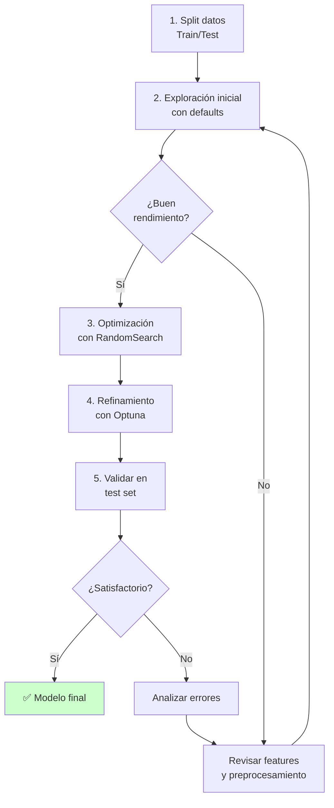

**Pasos**:

1. **Split inicial**: 80/20 o 70/30
2. **Baseline**: Entrenar con hiperparámetros default
3. **Primera optimización**: RandomizedSearchCV (n_iter=50-100)
4. **Refinamiento**: Optuna (n_trials=100-200) en rango reducido
5. **Validación final**: Test set NO VISTO
6. **Análisis**: Importancia de features, errores, curvas de aprendizaje

---

## Referencias

### Documentación Oficial

1. **scikit-learn Model Selection**: https://scikit-learn.org/stable/model_selection.html
2. **scikit-learn GridSearchCV**: https://scikit-learn.org/stable/modules/generated/sklearn.model_selection.GridSearchCV.html
3. **scikit-learn RandomizedSearchCV**: https://scikit-learn.org/stable/modules/generated/sklearn.model_selection.RandomizedSearchCV.html
4. **scikit-learn Cross-Validation**: https://scikit-learn.org/stable/modules/cross_validation.html

### Optuna

5. **Optuna Documentation**: https://optuna.readthedocs.io/
6. **Optuna GitHub**: https://github.com/optuna/optuna
7. **Optuna Examples**: https://github.com/optuna/optuna-examples

### Artículos y Tutoriales

8. **Hyperparameter Tuning the Random Forest** - Towards Data Science
9. **A Conceptual Explanation of Bayesian Hyperparameter Optimization** - Machine Learning Mastery
10. **Optuna: A Next-generation Hyperparameter Optimization Framework** - Paper KDD 2019

### Otros Frameworks

11. **Hyperopt**: http://hyperopt.github.io/hyperopt/
12. **Ray Tune**: https://docs.ray.io/en/latest/tune/index.html
13. **Keras Tuner**: https://keras.io/keras_tuner/

---

**Licencia**: MIT License
**Autor**: David Palacio Jiménez
**Fecha**: 2025
**Versión**: 1.0
