# Tutorial: Interpretabilidad de Modelos de Machine Learning

## Índice

1. [Introducción](#introducción)
2. [¿Por qué es importante la interpretabilidad?](#por-qué-es-importante-la-interpretabilidad)
3. [Interpretación Global: Feature Importance](#interpretación-global-feature-importance)
4. [Interpretación Local: SHAP](#interpretación-local-shap)
5. [Interpretación Local: LIME](#interpretación-local-lime)
6. [Comparación de Métodos](#comparación-de-métodos)
7. [Casos de Uso Prácticos](#casos-de-uso-prácticos)
8. [Referencias](#referencias)

---

## Introducción

### El Problema de la "Caja Negra"

```mermaid
graph LR
    A[Datos de<br/>entrada] --> B[🎩<br/>Modelo ML<br/>¿?¿?¿?]
    B --> C[Predicción]

    D[Usuario] --> E{¿Por qué<br/>predijo eso?}
    E --> F[❌ No lo sé]

    style B fill:#333
    style F fill:#ffcccc
```

Muchos modelos de ML funcionan como **"cajas negras"**: dan predicciones pero no explican **por qué**.

### La Solución: Interpretabilidad

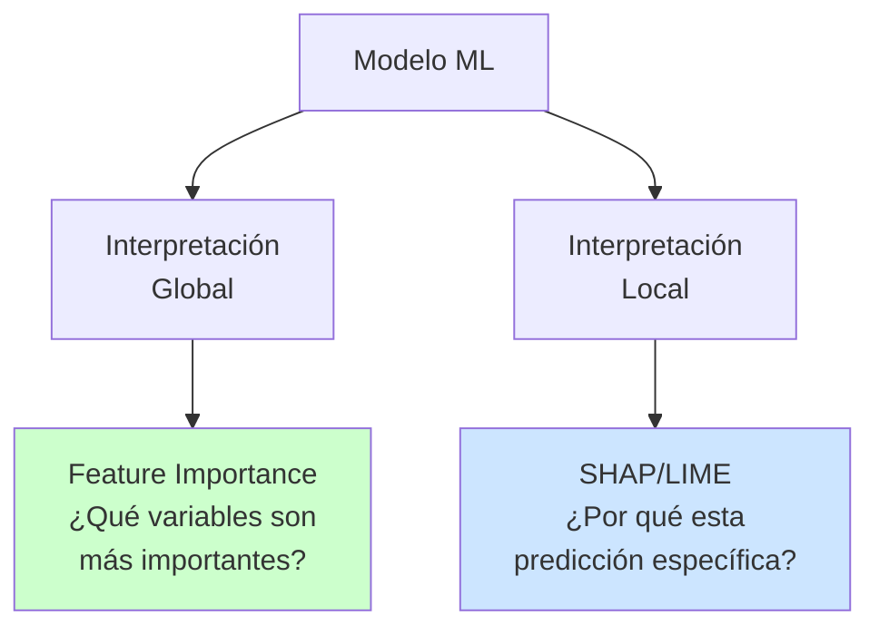

**Dos niveles de interpretación**:

| Nivel | Pregunta | Métodos | Cuándo Usar |
|-------|----------|---------|-------------|
| **Global** | ¿Qué variables son importantes **en general**? | Feature Importance, SHAP global | Entender el modelo completo |
| **Local** | ¿Por qué **esta predicción específica**? | SHAP local, LIME | Explicar decisiones individuales |

---

## ¿Por qué es importante la interpretabilidad?

### Casos de Uso Reales

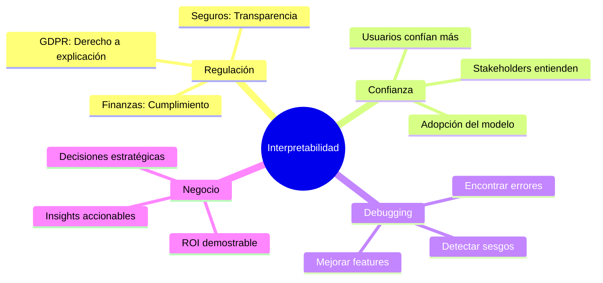

### Ejemplos Concretos

#### 1. Medicina

```
Modelo: Predicción de riesgo de enfermedad cardíaca
Predicción: "Alto riesgo (85%)"

❌ Sin interpretabilidad:
   "Tiene 85% de riesgo" → El médico no sabe qué factores considerar

✅ Con interpretabilidad:
   "85% de riesgo PORQUE:
   - Colesterol: +25%
   - Presión arterial: +30%
   - Edad: +15%
   - Tabaquismo: +15%"

   → El médico puede dar recomendaciones específicas
```

#### 2. Préstamos Bancarios

```
Modelo: Aprobación de préstamo
Predicción: "RECHAZADO"

❌ Sin interpretabilidad:
   "Préstamo denegado" → Cliente frustrado, posible demanda

✅ Con interpretabilidad:
   "Denegado PORQUE:
   - Historial crediticio insuficiente (-40%)
   - Ratio deuda/ingreso alto (-35%)
   - Sin ahorros (-25%)"

   → Cliente entiende y puede mejorar
```

#### 3. Marketing

```
Modelo: Predicción de abandono de clientes (churn)
Predicción: "Cliente probablemente abandonará"

❌ Sin interpretabilidad:
   "Churn probable" → ¿Qué hacer?

✅ Con interpretabilidad:
   "Churn probable PORQUE:
   - Baja frecuencia de uso (-30%)
   - No abre emails (-25%)
   - Precio alto vs competencia (-20%)"

   → Equipo sabe qué acciones tomar
```

---

## Interpretación Global: Feature Importance

### ¿Qué es Feature Importance?

**Definición**: Mide cuánto **contribuye cada variable** a las predicciones del modelo **en promedio**.

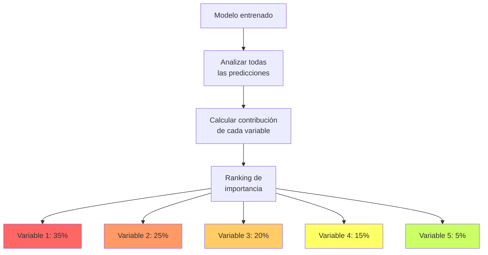

### Ejemplo Visual: Predicción de Precio de Casas

```
Dataset: Predecir precio de casas

Variables:
┌─────────────────┬──────────────────┐
│ Variable        │ Importancia      │
├─────────────────┼──────────────────┤
│ Ubicación       │ ████████████ 40% │ ← MÁS importante
│ Tamaño (m²)     │ ████████ 30%     │
│ Año construc.   │ █████ 15%        │
│ Num. habitac.   │ ███ 10%          │
│ Color fachada   │ █ 5%             │ ← MENOS importante
└─────────────────┴──────────────────┘

Interpretación:
✅ La ubicación es el factor más determinante (40%)
✅ El tamaño también es muy importante (30%)
⚠️ El color de la fachada casi no importa (5%)
```

---

### Métodos de Cálculo

#### 1. Importancia Basada en Impureza (Tree-based)

**Concepto**: En árboles de decisión, mide cuánto **reduce la impureza** cada variable cuando se usa para dividir.

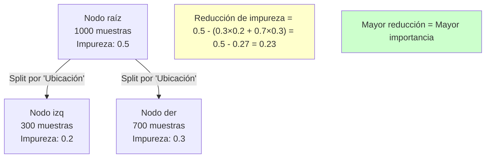

**Visualización**:

```
Antes del split (Ubicación):
┌──────────────────────────┐
│ Mezcla de precios:       │
│ $100k, $500k, $200k,     │
│ $400k, $150k, $600k...   │
│ Impureza ALTA = 0.5      │
└──────────────────────────┘

Después del split:
┌───────────────┐  ┌──────────────┐
│ Zona A:       │  │ Zona B:      │
│ $100k, $150k  │  │ $500k, $600k │
│ $120k, $180k  │  │ $550k, $580k │
│ Impureza BAJA │  │ Impureza BAJA│
└───────────────┘  └──────────────┘

→ Ubicación es IMPORTANTE porque reduce mucho la impureza
```

#### Código con scikit-learn

```python
from sklearn.ensemble import RandomForestRegressor
import pandas as pd
import matplotlib.pyplot as plt
import numpy as np

# Datos de ejemplo
data = {
    'ubicacion_score': [8, 3, 9, 2, 7, 4, 8, 3, 9, 6],
    'tamano_m2': [120, 80, 150, 70, 130, 85, 140, 75, 160, 95],
    'ano_construccion': [2020, 1990, 2018, 1985, 2015, 1995, 2019, 1988, 2021, 2000],
    'num_habitaciones': [3, 2, 4, 2, 3, 2, 4, 2, 4, 3],
    'color_fachada': [1, 2, 1, 3, 2, 1, 2, 3, 1, 2],  # 1=blanco, 2=beige, 3=gris
    'precio': [450000, 180000, 520000, 150000, 410000, 190000, 480000, 160000, 550000, 280000]
}

df = pd.DataFrame(data)

# Preparar datos
X = df.drop('precio', axis=1)
y = df['precio']

# Entrenar modelo
model = RandomForestRegressor(n_estimators=100, random_state=42)
model.fit(X, y)

# Obtener importancias
importances = model.feature_importances_
feature_names = X.columns

# Crear DataFrame para visualización
importance_df = pd.DataFrame({
    'feature': feature_names,
    'importance': importances
}).sort_values('importance', ascending=False)

print(importance_df)

# Visualización
plt.figure(figsize=(10, 6))
plt.barh(importance_df['feature'], importance_df['importance'])
plt.xlabel('Importancia')
plt.title('Feature Importance - Random Forest')
plt.tight_layout()
plt.show()

# Ejemplo de salida:
#              feature  importance
# 0  ubicacion_score      0.45
# 1       tamano_m2      0.30
# 2  ano_construccion    0.15
# 3   num_habitaciones   0.08
# 4    color_fachada     0.02
```

---

#### 2. Importancia por Permutación

**Concepto**: Mide cuánto **empeora** el modelo si **desordenamos** (permutamos) una variable.

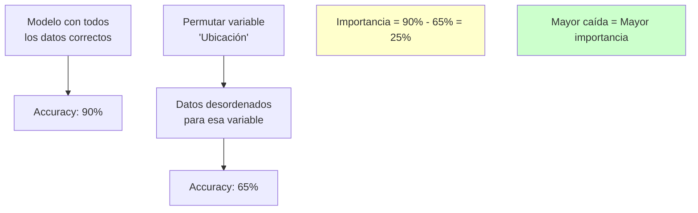

**Visualización del Proceso**:

```
Paso 1: Datos originales
┌──────────┬─────────┬────────┐
│ Ubicación│ Tamaño  │ Precio │
├──────────┼─────────┼────────┤
│ Centro   │ 120 m²  │ $450k  │
│ Periferia│ 80 m²   │ $180k  │
│ Centro   │ 150 m²  │ $520k  │
└──────────┴─────────┴────────┘
Modelo predice bien → Accuracy 90%

Paso 2: Permutar 'Ubicación'
┌──────────┬─────────┬────────┐
│ Ubicación│ Tamaño  │ Precio │
├──────────┼─────────┼────────┤
│ Centro   │ 120 m²  │ $450k  │
│ Centro   │ 80 m²   │ $180k  │ ← Ahora 'Centro' con precio bajo
│ Periferia│ 150 m²  │ $520k  │ ← Ahora 'Periferia' con precio alto
└──────────┴─────────┴────────┘
Modelo confundido → Accuracy 65%

Paso 3: Calcular importancia
Importancia de 'Ubicación' = 90% - 65% = 25%
→ Ubicación es MUY importante (perderla afecta mucho)

Paso 4: Permutar 'Color Fachada'
Modelo casi igual → Accuracy 89%
Importancia de 'Color' = 90% - 89% = 1%
→ Color NO es importante
```

#### Código con scikit-learn

```python
from sklearn.inspection import permutation_importance

# Calcular importancia por permutación
perm_importance = permutation_importance(
    model, X, y,
    n_repeats=10,       # Repetir 10 veces para promediar
    random_state=42,
    n_jobs=-1
)

# Obtener importancias
perm_importances = perm_importance.importances_mean

# Crear DataFrame
perm_importance_df = pd.DataFrame({
    'feature': feature_names,
    'importance': perm_importances,
    'std': perm_importance.importances_std
}).sort_values('importance', ascending=False)

print(perm_importance_df)

# Visualización con barras de error
plt.figure(figsize=(10, 6))
plt.barh(perm_importance_df['feature'], perm_importance_df['importance'],
         xerr=perm_importance_df['std'])
plt.xlabel('Importancia por Permutación')
plt.title('Permutation Importance')
plt.tight_layout()
plt.show()
```

---

### Comparación de Métodos de Feature Importance

| Método | Ventajas | Desventajas | Cuándo Usar |
|--------|----------|-------------|-------------|
| **Impureza** | Rápido, integrado en tree models | Solo para tree-based, sesgado a altas cardinalidades | Random Forest, árboles de decisión |
| **Permutación** | Model-agnostic, no sesgado | Más lento, requiere datos de validación | Cualquier modelo, validación |

---

### Visualizaciones Avanzadas

#### 1. Gráfico de Barras Horizontal

```python
import matplotlib.pyplot as plt
import seaborn as sns

# Configurar estilo
sns.set_style("whitegrid")

# Crear gráfico
fig, ax = plt.subplots(figsize=(10, 6))

# Barras horizontales con colores degradados
colors = plt.cm.RdYlGn(np.linspace(0.3, 0.9, len(importance_df)))
bars = ax.barh(importance_df['feature'], importance_df['importance'], color=colors)

# Añadir valores en las barras
for i, (bar, val) in enumerate(zip(bars, importance_df['importance'])):
    ax.text(val + 0.01, bar.get_y() + bar.get_height()/2,
            f'{val:.1%}', va='center', fontweight='bold')

ax.set_xlabel('Importancia Relativa', fontsize=12)
ax.set_title('Feature Importance - Predicción de Precios de Casas',
             fontsize=14, fontweight='bold')
ax.set_xlim(0, max(importance_df['importance']) * 1.15)

plt.tight_layout()
plt.show()
```

#### 2. Gráfico de Pastel

```python
# Gráfico de pastel para importancias
plt.figure(figsize=(10, 8))

# Colores
colors = plt.cm.Set3(range(len(importance_df)))

# Crear gráfico de pastel
wedges, texts, autotexts = plt.pie(
    importance_df['importance'],
    labels=importance_df['feature'],
    autopct='%1.1f%%',
    startangle=90,
    colors=colors,
    explode=[0.1 if i == 0 else 0 for i in range(len(importance_df))]  # Destacar el más importante
)

# Estilo
for text in texts:
    text.set_fontsize(12)
for autotext in autotexts:
    autotext.set_color('white')
    autotext.set_fontweight('bold')
    autotext.set_fontsize(10)

plt.title('Distribución de Feature Importance', fontsize=14, fontweight='bold')
plt.axis('equal')
plt.tight_layout()
plt.show()
```

#### 3. Comparación de Métodos

```python
# Comparar Impureza vs Permutación
fig, (ax1, ax2) = plt.subplots(1, 2, figsize=(16, 6))

# Impureza
ax1.barh(importance_df['feature'], importance_df['importance'], color='steelblue')
ax1.set_xlabel('Importancia')
ax1.set_title('Basada en Impureza (Tree-based)')

# Permutación
ax2.barh(perm_importance_df['feature'], perm_importance_df['importance'],
         xerr=perm_importance_df['std'], color='coral')
ax2.set_xlabel('Importancia')
ax2.set_title('Basada en Permutación')

plt.tight_layout()
plt.show()
```

---

## Interpretación Local: SHAP

### ¿Qué es SHAP?

**SHAP (SHapley Additive exPlanations)** explica **cada predicción individual** mostrando la contribución de cada variable.

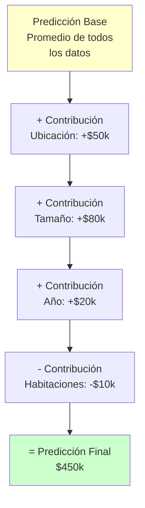

### Concepto Intuitivo

```
Pregunta: ¿Por qué esta casa cuesta $450k?

Respuesta SHAP:

Precio base (promedio de todas las casas): $310k
                                              ↓
+ Ubicación es 'Centro'         → +$50k     ($360k)
+ Tamaño es 120m² (grande)      → +$80k     ($440k)
+ Año construcción 2020 (nuevo) → +$20k     ($460k)
- Solo 3 habitaciones (pocas)   → -$10k     ($450k) ✅
                                              ↓
                        Predicción final: $450k

Conclusión: El precio alto se debe principalmente al tamaño (+$80k)
            y ubicación (+$50k)
```

---

### Ejemplo Visual: Clasificación de Préstamos

```
Caso: ¿Por qué se APROBÓ el préstamo del Cliente A?

Probabilidad base de aprobación: 50%

┌────────────────────────────────────────────────┐
│ Ingreso alto ($80k/año)        →  +25%  (75%) │
│ Historial crediticio bueno     →  +15%  (90%) │
│ Empleo estable (5 años)        →  +8%   (98%) │
│ Tiene ahorros ($20k)           →  +2%   (100%)│
│ Edad joven (28 años)           →  -5%   (95%) │
│ Sin propiedad                  →  -10%  (85%) │
└────────────────────────────────────────────────┘
                                    Predicción: 85% APROBADO ✅

Interpretación:
✅ Ingreso alto es el factor MÁS importante (+25%)
✅ Buen historial crediticio también ayuda mucho (+15%)
⚠️ No tener propiedad es un factor negativo (-10%)
```

---

### Instalación y Uso de SHAP

```python
# Instalar SHAP
# pip install shap

import shap
import numpy as np
import matplotlib.pyplot as plt

# 1. Entrenar modelo
from sklearn.ensemble import RandomForestClassifier
from sklearn.model_selection import train_test_split

# Datos de ejemplo: aprobación de préstamos
data = {
    'ingreso': [80000, 45000, 120000, 35000, 95000, 50000],
    'historial_crediticio': [750, 620, 800, 580, 720, 640],
    'anos_empleo': [5, 2, 10, 1, 7, 3],
    'ahorros': [20000, 5000, 50000, 2000, 30000, 8000],
    'edad': [28, 45, 35, 22, 40, 50],
    'tiene_propiedad': [0, 1, 1, 0, 1, 0],
    'aprobado': [1, 0, 1, 0, 1, 0]  # 1=Aprobado, 0=Rechazado
}

df = pd.DataFrame(data)
X = df.drop('aprobado', axis=1)
y = df['aprobado']

X_train, X_test, y_train, y_test = train_test_split(X, y, test_size=0.3, random_state=42)

model = RandomForestClassifier(n_estimators=100, random_state=42)
model.fit(X_train, y_train)

# 2. Crear explainer de SHAP
explainer = shap.TreeExplainer(model)

# 3. Calcular SHAP values
shap_values = explainer.shap_values(X_test)

# Si el modelo devuelve probabilidades para ambas clases:
# shap_values será una lista [shap_values_clase0, shap_values_clase1]
# Usamos la clase positiva (aprobado = 1)
if isinstance(shap_values, list):
    shap_values = shap_values[1]

print("SHAP values shape:", shap_values.shape)
```

---

### Visualizaciones de SHAP

#### 1. Force Plot (Explicación Individual)

```python
# Explicar UNA predicción específica (ej: primera muestra de test)
shap.initjs()  # Para visualización en notebooks

# Force plot para la primera muestra
shap.force_plot(
    explainer.expected_value[1],  # Valor base
    shap_values[0, :],            # SHAP values de la primera muestra
    X_test.iloc[0, :],            # Valores de features de la primera muestra
    matplotlib=True
)

# Este gráfico muestra:
# - Base value (rojo): predicción promedio
# - Flechas rojas: contribuciones positivas (aumentan probabilidad)
# - Flechas azules: contribuciones negativas (disminuyen probabilidad)
# - Output value: predicción final
```

**Interpretación del Force Plot**:

```
Force Plot Ejemplo:

Base value: 0.50 (50% de probabilidad base)

[←────────]  [──────────→]
  Negativo     Positivo

Ingreso=80k              ────→  +0.25
Historial=750           ─────→  +0.15
Empleo=5años            ───→    +0.08
Tiene_propiedad=No  ←──         -0.10
Edad=28             ←─          -0.05
Ahorros=20k              ──→    +0.02
                                ------
                         Output: 0.85 (85% probabilidad)

Interpretación:
- Ingreso alto (+0.25) es el factor MÁS importante a favor
- No tener propiedad (-0.10) es el principal factor en contra
```

---

#### 2. Waterfall Plot (Cascada)

```python
# Waterfall plot para una muestra
shap.plots.waterfall(
    shap.Explanation(
        values=shap_values[0],
        base_values=explainer.expected_value[1],
        data=X_test.iloc[0],
        feature_names=X_test.columns.tolist()
    )
)
```

**Visualización de Waterfall**:

```
Waterfall Plot (Cascada):

Probabilidad
    1.0 ┤
        │                                    ┌─────┐
        │                               ┌────┤ 0.85│ ← Predicción final
    0.8 ┤                          ┌────┤    └─────┘
        │                     ┌────┤ 0.73
        │                ┌────┤ 0.65
    0.6 ┤           ┌────┤ 0.58
        │      ┌────┤ 0.50 (base)
    0.4 ┤ ┌────┤ 0.45
        ├─┴────┴────┴────┴────┴────┴────┴───→
          Edad Prop. Ahorro Empleo Hist. Ingreso
          -0.05 -0.10 +0.02 +0.08 +0.15 +0.25

Cada barra muestra cómo la contribución de cada feature
va construyendo la predicción final paso a paso.
```

---

#### 3. Summary Plot (Resumen Global)

```python
# Summary plot (muestra importancia Y efecto para TODAS las muestras)
shap.summary_plot(shap_values, X_test, plot_type="dot")
```

**Interpretación del Summary Plot**:

```
Summary Plot (Diagrama de Puntos):

Features (ordenadas por importancia):

Ingreso           ●●●●●○○○○○○○○  ← Valores altos (rojo) → efecto positivo
                  ○○○○○●●●        Valores bajos (azul) → efecto negativo

Historial         ●●●●○○○○○○
                  ○○○●●●

Empleo            ●●●○○○
                  ○●●

Ahorros           ●●○○
                  ○●

Edad              ●●○
                  ○●

Propiedad         ●○
                  ○

      ─┼────┼────┼────┼────┼────┼────┼────→
      -0.3  -0.2  -0.1   0   0.1  0.2  0.3
           SHAP value (impacto en predicción)

Interpretación:
● Puntos rojos = valores altos de la feature
○ Puntos azules = valores bajos de la feature

Ingreso: Valores altos (rojo) están a la derecha (efecto positivo)
         Valores bajos (azul) están a la izquierda (efecto negativo)
```

---

#### 4. Dependence Plot (Relación con una Variable)

```python
# Dependence plot: muestra la relación entre una feature y su SHAP value
shap.dependence_plot("ingreso", shap_values, X_test)
```

**Interpretación del Dependence Plot**:

```
Dependence Plot (Ingreso vs SHAP Value):

SHAP Value
   0.3 ┤                        ●●●
       │                    ●●●●
   0.2 ┤                ●●●●
       │            ●●●●
   0.1 ┤        ●●●●
       │    ●●●●
   0.0 ┼●●●●
       │
  -0.1 ┤
       └─────┴─────┴─────┴─────┴─────→
        $20k  $40k  $60k  $80k $100k $120k
                    Ingreso

Interpretación:
- Relación POSITIVA: Mayor ingreso → Mayor SHAP value (mayor prob. aprobación)
- La relación es casi lineal
- A partir de $80k, el efecto se estabiliza
```

---

#### 5. Bar Plot (Importancia Global)

```python
# Bar plot: importancia promedio absoluta de cada feature
shap.summary_plot(shap_values, X_test, plot_type="bar")
```

**Visualización**:

```
Bar Plot (Importancia Promedio):

Ingreso           ████████████████ 0.18
Historial         ████████████ 0.12
Empleo            ███████ 0.08
Propiedad         █████ 0.06
Ahorros           ███ 0.04
Edad              ██ 0.03
                  ─┴────┴────┴────→
                   0   0.05  0.10  0.15  0.20
                   mean(|SHAP value|)

Muestra la importancia PROMEDIO de cada variable
(promedio del valor absoluto de SHAP values)
```

---

### SHAP para Diferentes Modelos

```python
# Random Forest / Tree-based
explainer = shap.TreeExplainer(model)

# Linear Models
explainer = shap.LinearExplainer(model, X_train)

# Neural Networks / Cualquier modelo
explainer = shap.KernelExplainer(model.predict, X_train)

# Deep Learning (PyTorch, TensorFlow)
explainer = shap.DeepExplainer(model, X_train)
```

---

## Interpretación Local: LIME

### ¿Qué es LIME?

**LIME (Local Interpretable Model-agnostic Explanations)** crea un **modelo simple** (lineal) alrededor de una predicción para explicarla.

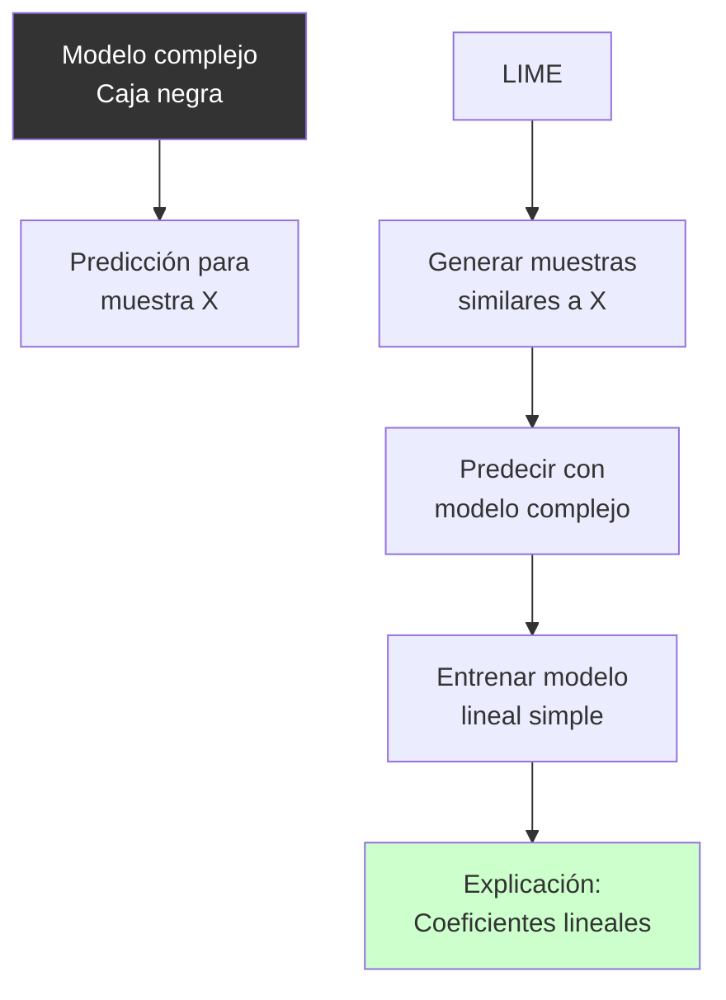

### Concepto Intuitivo

```
Objetivo: Explicar una predicción específica

Paso 1: Modelo complejo (Random Forest) predice
        Casa con ubicación='Centro', tamaño=120m² → Precio: $450k

Paso 2: LIME genera variaciones de esta casa
        - Centro, 115m² → ¿Precio?
        - Centro, 125m² → ¿Precio?
        - Periferia, 120m² → ¿Precio?
        - Centro, 110m² → ¿Precio?
        ... (miles de variaciones)

Paso 3: LIME predice cada variación con el modelo complejo

Paso 4: LIME ajusta modelo lineal simple:
        Precio ≈ 200k + (100k × ubicación_centro) + (2k × cada_m²)

Paso 5: Explicación simple:
        "Para esta casa, cada m² adicional añade $2k al precio,
         y estar en el centro añade $100k"
```

---

### Instalación y Uso de LIME

```python
# Instalar LIME
# pip install lime

import lime
import lime.lime_tabular
import numpy as np

# 1. Crear explainer de LIME
explainer = lime.lime_tabular.LimeTabularExplainer(
    training_data=X_train.values,
    feature_names=X_train.columns.tolist(),
    class_names=['Rechazado', 'Aprobado'],
    mode='classification'
)

# 2. Explicar UNA predicción
idx = 0  # Primera muestra de test
exp = explainer.explain_instance(
    data_row=X_test.iloc[idx].values,
    predict_fn=model.predict_proba,
    num_features=6  # Mostrar top 6 features
)

# 3. Visualizar explicación
exp.show_in_notebook(show_table=True)

# 4. Como figura matplotlib
fig = exp.as_pyplot_figure()
plt.tight_layout()
plt.show()

# 5. Obtener explicación como lista
print(exp.as_list())
# Ejemplo de salida:
# [('ingreso > 70000', 0.25),
#  ('historial_crediticio > 700', 0.18),
#  ('tiene_propiedad = 0', -0.12),
#  ...]
```

---

### Visualización de LIME

#### Gráfico de Barras LIME

```
Explicación LIME para Cliente A (Predicción: 85% Aprobado):

Contribución a "Aprobado":

Ingreso > $70k           ████████████ +0.25
Historial > 700          ████████ +0.18
Años empleo > 4          ████ +0.08
Ahorros > $15k           ██ +0.05

Contribución a "Rechazado":

No tiene propiedad       ████ -0.12
Edad < 30                ██ -0.05

                    ─┴────┴────┴────┴────→
                   -0.2  -0.1   0   0.1  0.2  0.3

Interpretación:
- El factor MÁS importante es el ingreso alto (+0.25)
- No tener propiedad es el principal factor negativo (-0.12)
- En balance: 85% de probabilidad de aprobación
```

---

### Ejemplo Completo: Clasificación de Texto

```python
from lime.lime_text import LimeTextExplainer
from sklearn.pipeline import make_pipeline
from sklearn.feature_extraction.text import TfidfVectorizer
from sklearn.linear_model import LogisticRegression

# Datos de ejemplo
texts = [
    "Me encantó la película, excelente actuación",
    "Película horrible, muy aburrida",
    "Obra maestra del cine",
    "No la recomiendo, muy mala"
]
labels = [1, 0, 1, 0]  # 1=Positivo, 0=Negativo

# Pipeline
pipeline = make_pipeline(
    TfidfVectorizer(),
    LogisticRegression()
)
pipeline.fit(texts, labels)

# LIME para texto
text_explainer = LimeTextExplainer(class_names=['Negativo', 'Positivo'])

# Explicar una predicción
text_to_explain = "La película estuvo excelente, muy buena"
exp = text_explainer.explain_instance(
    text_to_explain,
    pipeline.predict_proba,
    num_features=6
)

# Visualizar
print("Predicción:", pipeline.predict([text_to_explain])[0])
print("Probabilidad Positivo:", pipeline.predict_proba([text_to_explain])[0][1])

exp.show_in_notebook(text=True)

# Lista de palabras importantes
print("\nPalabras que más contribuyen:")
print(exp.as_list())
```

**Interpretación del Output**:

```
Texto: "La película estuvo excelente, muy buena"
Predicción: Positivo (92%)

Palabras que contribuyen a POSITIVO:
  excelente   ████████ +0.35
  buena       ██████ +0.25
  película    ██ +0.08

Palabras que contribuyen a NEGATIVO:
  (ninguna significativa)

Visualización del texto:
"La película estuvo EXCELENTE, muy BUENA"
  └─────────────────┘ └────────┘  └───┘
        +0.08          +0.35     +0.25

Interpretación:
- "excelente" es la palabra MÁS importante (+0.35)
- "buena" también contribuye fuertemente (+0.25)
- El modelo detectó correctamente el sentimiento positivo
```

---

## Comparación de Métodos

### Tabla Comparativa Completa

| Aspecto | Feature Importance | SHAP | LIME |
|---------|-------------------|------|------|
| **Nivel** | Global | Global + Local | Local |
| **¿Qué explica?** | Importancia general | Contribución exacta por muestra | Aproximación local |
| **Precisión** | Aproximada | Matemáticamente exacta | Aproximación |
| **Velocidad** | ⚡⚡⚡ Muy rápido | ⚡⚡ Medio | ⚡ Lento |
| **Modelos** | Solo tree-based | Todos (con explainers específicos) | Todos (model-agnostic) |
| **Consistencia** | Variable | Alta (teoría de juegos) | Variable |
| **Facilidad** | 🟢 Muy fácil | 🟡 Media | 🟡 Media |
| **Visualizaciones** | Barras simples | Múltiples (force, waterfall, etc.) | Barras + texto |

---

### Diagrama de Decisión

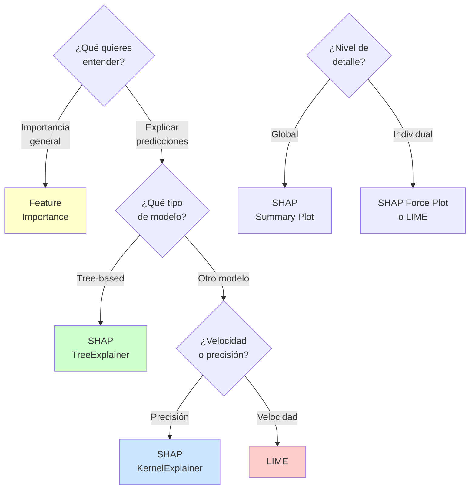

### Ejemplo de Uso Combinado

```python
# Flujo completo de interpretabilidad

# 1. Feature Importance (visión global rápida)
importances = model.feature_importances_
print("Top 3 features:", X.columns[np.argsort(importances)[-3:]])

# 2. SHAP Global (entender direcciones)
explainer = shap.TreeExplainer(model)
shap_values = explainer.shap_values(X_test)
shap.summary_plot(shap_values[1], X_test)

# 3. SHAP Local (explicar predicciones específicas)
# Casos interesantes: falsos positivos, falsos negativos
false_positives = X_test[(y_test == 0) & (model.predict(X_test) == 1)]
if len(false_positives) > 0:
    shap.force_plot(
        explainer.expected_value[1],
        shap_values[1][0],
        false_positives.iloc[0]
    )

# 4. LIME (para stakeholders no técnicos)
lime_explainer = lime.lime_tabular.LimeTabularExplainer(
    X_train.values,
    feature_names=X_train.columns.tolist(),
    class_names=['Rechazado', 'Aprobado'],
    mode='classification'
)

exp = lime_explainer.explain_instance(
    false_positives.iloc[0].values,
    model.predict_proba,
    num_features=5
)
exp.show_in_notebook()
```

---

## Casos de Uso Prácticos

### 1. Diagnóstico Médico

```python
"""
Caso: Predicción de riesgo de diabetes

Variables:
- Edad
- IMC (Índice de Masa Corporal)
- Glucosa en sangre
- Presión arterial
- Historial familiar
"""

# Feature Importance
importances = model.feature_importances_
# Resultado: Glucosa (45%), IMC (30%), Edad (15%), ...

# SHAP para paciente específico
shap.force_plot(
    explainer.expected_value[1],
    shap_values_paciente,
    datos_paciente
)

"""
Interpretación para Paciente X:
- Riesgo: 78%
- Factores principales:
  * Glucosa elevada (120 mg/dL) → +25%
  * IMC alto (32) → +18%
  * Edad avanzada (65 años) → +10%

Recomendación médica:
→ Enfocarse en controlar glucosa (mayor impacto)
→ Plan de reducción de peso
→ Monitoreo regular por edad
"""
```

---

### 2. Aprobación de Créditos

```python
"""
Caso: Explicar rechazo de préstamo

Cliente rechazado con 35% de probabilidad de aprobación
"""

# LIME explanation
exp = lime_explainer.explain_instance(
    cliente_datos,
    model.predict_proba,
    num_features=6
)

"""
Explicación para el cliente:

Su solicitud fue RECHAZADA porque:

Factores negativos:
❌ Historial crediticio bajo (580) → -30%
❌ Ingresos insuficientes ($35k/año) → -20%
❌ Sin propiedad → -15%

Factores positivos:
✅ Años de empleo (5 años) → +10%
✅ Ahorros ($8k) → +5%

Recomendación:
Para mejorar sus posibilidades:
1. Mejorar historial crediticio (mayor impacto)
2. Aumentar ingresos o solicitar monto menor
3. Considerar co-solicitante
"""
```

---

### 3. Marketing: Predicción de Churn

```python
"""
Caso: Identificar por qué clientes abandonan

Análisis global + local
"""

# 1. Feature Importance Global
print("Factores que más influyen en el churn:")
# Resultado:
# - Frecuencia de uso: 35%
# - Precio vs competencia: 25%
# - Satisfacción customer service: 20%
# - Antigüedad: 15%
# - Características premium: 5%

# 2. SHAP para cliente en riesgo
cliente_riesgo = clientes[clientes['prob_churn'] > 0.8].iloc[0]

shap.waterfall_plot(
    shap.Explanation(
        values=shap_values[idx],
        base_values=explainer.expected_value[1],
        data=cliente_riesgo
    )
)

"""
Cliente ID: 12345
Probabilidad de abandono: 85%

Causas principales:
1. Uso bajo (2 veces/mes) → +30%
   → Acción: Email con nuevas features

2. Precio 20% más alto que competencia → +25%
   → Acción: Oferta descuento personalizado

3. Ticket de soporte sin resolver → +15%
   → Acción: Contacto prioritario de CS

4. No usa features premium → +10%
   → Acción: Tutorial personalizado

Estrategia de retención personalizada basada en SHAP
"""
```

---

### 4. Recursos Humanos: Predicción de Renuncia

```python
"""
Caso: Predecir qué empleados renunciarán

Interpretación para HR managers
"""

# Feature Importance
feature_importances = model.feature_importances_

"""
Factores de renuncia más importantes:

1. Satisfacción laboral (40%)
   → Focus en surveys y clima laboral

2. Salario relativo al mercado (30%)
   → Benchmarking y ajustes

3. Tiempo sin promoción (20%)
   → Plan de carrera

4. Balance vida-trabajo (10%)
   → Políticas de flexibilidad
"""

# SHAP para empleado en riesgo
empleado_riesgo = empleados[empleados['prob_renuncia'] > 0.7].iloc[0]

"""
Empleado: Juan Pérez
Probabilidad de renuncia: 82%

Análisis SHAP:

Factores de riesgo:
❌ Satisfacción baja (3/10) → +35%
❌ Salario 15% bajo vs mercado → +25%
❌ 4 años sin promoción → +18%
❌ Horas extra frecuentes → +10%

Factores de retención:
✅ Buen ambiente con equipo → -5%
✅ Beneficios competitivos → -3%

Plan de acción personalizado:
1. [URGENTE] Conversación salarial
2. [ALTA] Discutir plan de carrera
3. [MEDIA] Revisar carga de trabajo
4. [BAJA] Mantener ambiente de equipo
"""
```

---

## Mejores Prácticas

### 1. Combina Métodos

```python
# ❌ MAL: Usar solo un método
importances = model.feature_importances_
print("Top feature:", X.columns[np.argmax(importances)])
# Conclusión: Solo una vista limitada

# ✅ BIEN: Usar múltiples métodos
# Paso 1: Global overview
feature_importance_analysis()

# Paso 2: Validar con SHAP
shap_global_analysis()

# Paso 3: Explicar casos específicos
shap_local_analysis(casos_interesantes)
lime_analysis(casos_para_stakeholders)
```

### 2. Valida las Explicaciones

```python
# Verificar consistencia
# ¿SHAP y LIME dan explicaciones similares?

# Para la misma muestra:
lime_exp = lime_explainer.explain_instance(...)
shap_exp = shap_explainer.shap_values(...)

# Comparar top features
lime_top = [f for f, _ in lime_exp.as_list()[:3]]
shap_top = X.columns[np.argsort(np.abs(shap_exp))[-3:]]

print("LIME top 3:", lime_top)
print("SHAP top 3:", shap_top)
# Deberían ser similares si el modelo es estable
```

### 3. Documenta y Comunica

```python
# Crear reporte de interpretabilidad

report = {
    'model_type': 'Random Forest',
    'accuracy': 0.87,

    # Interpretación global
    'top_features': {
        'feature_1': 0.35,
        'feature_2': 0.28,
        'feature_3': 0.20
    },

    # Interpretaciones locales de casos clave
    'false_positives_analysis': [...],
    'false_negatives_analysis': [...],

    # Recomendaciones
    'actionable_insights': [
        "Feature X es el factor más importante",
        "Mejorar calidad de datos en Feature Y",
        "Considerar feature engineering para..."
    ]
}
```

### 4. Sanity Checks

```python
# Verificaciones de cordura

# 1. ¿Las importancias suman ~1?
assert abs(sum(model.feature_importances_) - 1.0) < 0.01

# 2. ¿Las features importantes tienen sentido de negocio?
top_features = X.columns[np.argsort(importances)[-3:]]
# Validar con expertos del dominio

# 3. ¿SHAP values reconstruyen la predicción?
prediction = model.predict_proba(X_test[0].reshape(1, -1))[0, 1]
shap_prediction = explainer.expected_value[1] + sum(shap_values[0])
assert abs(prediction - shap_prediction) < 0.01

# 4. ¿Explicaciones estables?
# Pequeños cambios en datos → pequeños cambios en explicación
```

---

## Resumen Visual

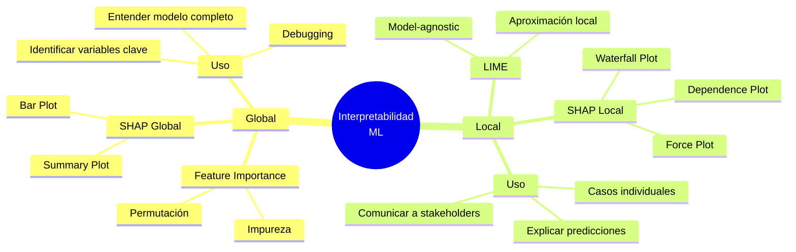

### Flujo de Trabajo Recomendado

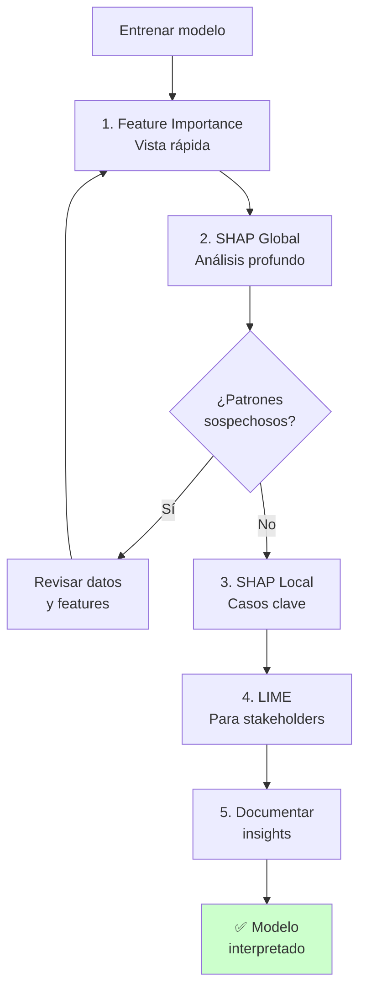

---

## Referencias

### Librerías

1. **SHAP GitHub**: https://github.com/slundberg/shap
2. **SHAP Documentation**: https://shap.readthedocs.io/
3. **LIME GitHub**: https://github.com/marcotcr/lime
4. **LIME Paper**: "Why Should I Trust You?" Ribeiro et al., 2016
5. **scikit-learn Inspection**: https://scikit-learn.org/stable/modules/inspection.html

### Artículos y Papers

6. **"A Unified Approach to Interpreting Model Predictions"** - Lundberg & Lee, 2017 (SHAP)
7. **"Interpretable Machine Learning"** - Christoph Molnar (libro online gratuito)
8. **"Stop Explaining Black Box Machine Learning Models"** - Rudin, 2019

### Tutoriales

9. **SHAP Tutorial**: https://shap.readthedocs.io/en/latest/example_notebooks/
10. **LIME Tutorial**: https://marcotcr.github.io/lime/tutorials/
11. **Feature Importance in scikit-learn**: https://scikit-learn.org/stable/auto_examples/ensemble/plot_forest_importances.html

### Herramientas Adicionales

12. **InterpretML**: https://interpret.ml/
13. **ELI5**: https://eli5.readthedocs.io/
14. **Yellowbrick**: https://www.scikit-yb.org/

---

**Licencia**: MIT License
**Autor**: David Palacio Jiménez
**Fecha**: 2025
**Versión**: 1.0
