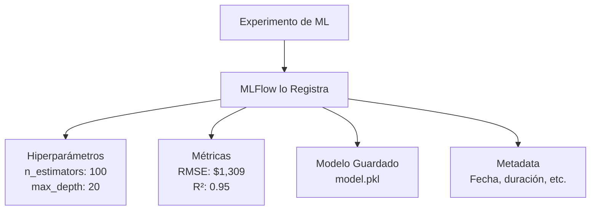
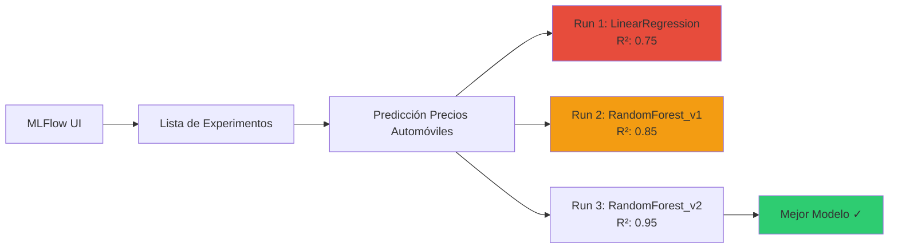
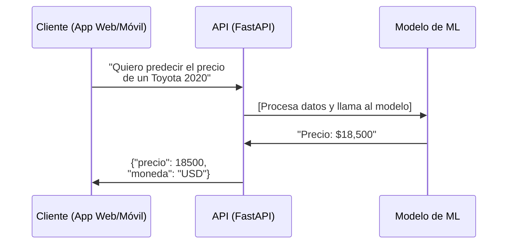
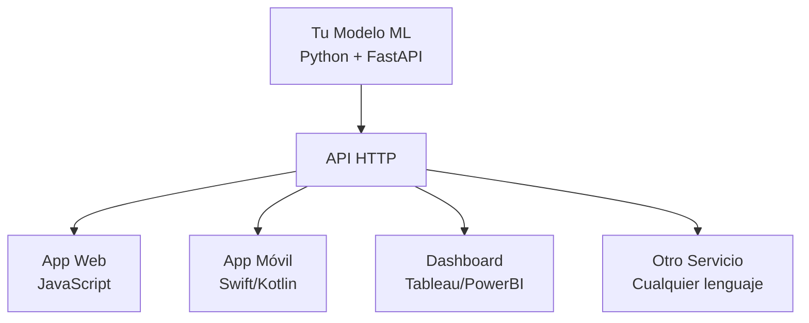
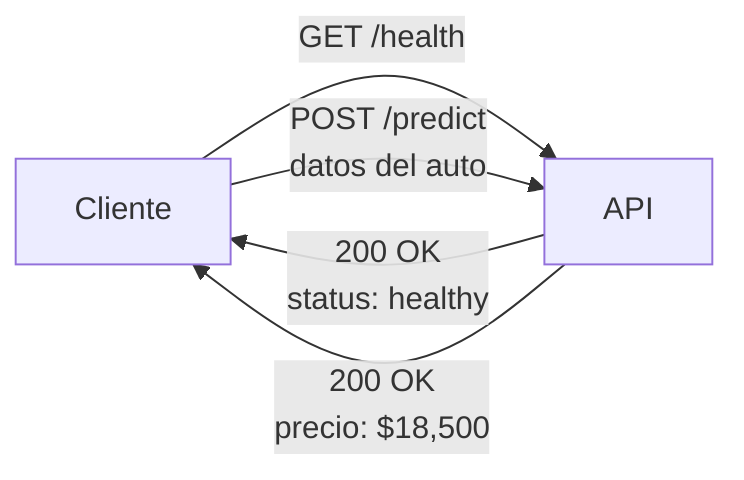
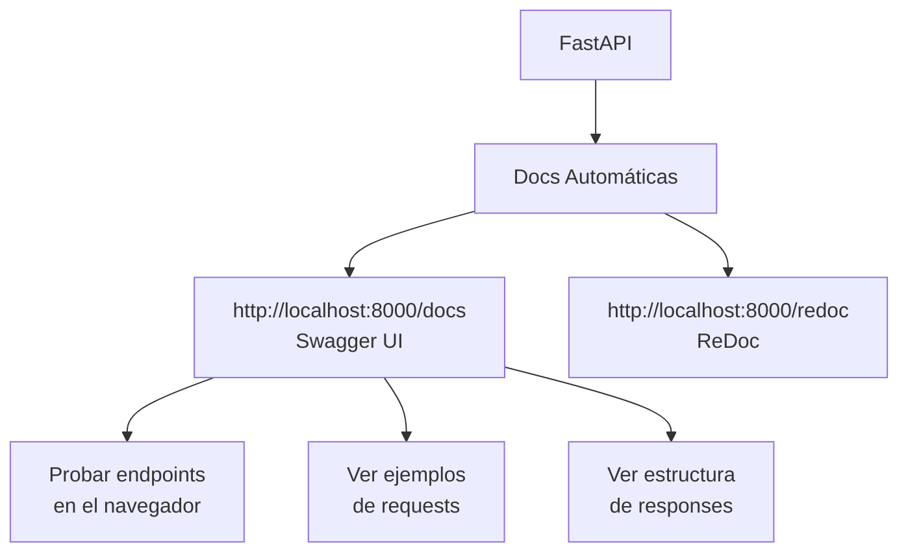
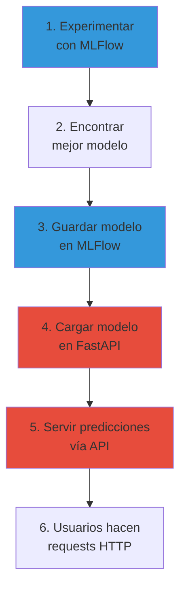

# MLFlow y FastAPI para Principiantes

## Introducción

Imagina que has creado un modelo de Machine Learning que funciona muy bien en tu computadora. Ahora tienes dos grandes desafíos:

1. **¿Cómo organizo mis experimentos?** Has probado 10 versiones diferentes, con distintos parámetros. ¿Cuál fue la mejor? ¿Qué configuración usaste?

2. **¿Cómo hago que otras personas usen mi modelo?** Tu modelo está en Python, pero la aplicación web está en JavaScript. ¿Cómo se comunican?

Aquí es donde entran **MLFlow** y **FastAPI**:
- **MLFlow**: Tu asistente personal para organizar experimentos
- **FastAPI**: Tu traductor para que tu modelo hable con el mundo

---

## Parte 1: MLFlow - Tu Asistente de Experimentos

### ¿Qué es MLFlow?

MLFlow es como un **cuaderno de laboratorio digital** donde registras todos tus experimentos de Machine Learning.

#### El Problema Sin MLFlow

Imagina que entrenas 5 modelos diferentes:

```python
# Intento 1
model1 = RandomForest(n_estimators=50, max_depth=10)
# Resultado: R² = 0.80
# ¿Qué hiperparámetros usé? ¿Dónde guardé el modelo?

# Intento 2
model2 = RandomForest(n_estimators=100, max_depth=15)
# Resultado: R² = 0.85
# ¿Mejor que el anterior? ¿Por cuánto?

# Intento 3... ¿qué hiperparámetros eran?
# Intento 4... ¿dónde guardé este modelo?
```

**Problemas:**
- ❌ No recuerdas qué hiperparámetros usaste en cada modelo
- ❌ No sabes cuál fue el mejor modelo
- ❌ No puedes comparar fácilmente los resultados
- ❌ Los modelos están guardados en diferentes carpetas sin orden

#### La Solución Con MLFlow

MLFlow registra automáticamente:
- ✅ Todos los hiperparámetros que usaste
- ✅ Todas las métricas (R², RMSE, MAE, etc.)
- ✅ El código que ejecutaste
- ✅ El modelo entrenado
- ✅ La fecha y hora del experimento



---

### Conceptos Clave de MLFlow

#### 1. Experiment (Experimento)

Un contenedor para un conjunto de pruebas relacionadas.

**Analogía:** Es como una carpeta en tu computadora.

```python
# Ejemplo: Estás trabajando en predecir precios de casas
mlflow.set_experiment("prediccion_precios_casas")

# Todos tus intentos se guardan en este experimento
```

#### 2. Run (Ejecución)

Una instancia específica de entrenamiento de modelo.

**Analogía:** Es como un archivo dentro de la carpeta.

```python
# Cada vez que entrenas un modelo, creas un nuevo "run"
with mlflow.start_run():
    # Entrenar modelo
    # Registrar métricas
```

#### 3. Parameters (Parámetros)

Los valores que configuraste para entrenar tu modelo.

```python
mlflow.log_param("n_estimators", 100)
mlflow.log_param("max_depth", 20)
mlflow.log_param("learning_rate", 0.01)
```

#### 4. Metrics (Métricas)

Los resultados del desempeño de tu modelo.

```python
mlflow.log_metric("rmse", 1309.54)
mlflow.log_metric("mae", 632.21)
mlflow.log_metric("r2", 0.9519)
```

#### 5. Artifacts (Artefactos)

Archivos generados (modelos, gráficos, etc.)

```python
mlflow.sklearn.log_model(model, "model")
mlflow.log_artifact("grafico.png")
```

---

### Ejemplo Práctico: Proyecto de Automóviles

Veamos cómo usamos MLFlow en nuestro proyecto:

```python
import mlflow
import mlflow.sklearn
from sklearn.ensemble import RandomForestRegressor

# 1. Crear o seleccionar un experimento
mlflow.set_experiment("prediccion_precios_automoviles")

# 2. Iniciar un run (una ejecución de entrenamiento)
with mlflow.start_run(run_name="random_forest_v1"):

    # 3. Definir hiperparámetros
    params = {
        'n_estimators': 100,
        'max_depth': 20,
        'min_samples_split': 5
    }

    # 4. Registrar parámetros en MLFlow
    for param_name, param_value in params.items():
        mlflow.log_param(param_name, param_value)

    # 5. Entrenar modelo
    model = RandomForestRegressor(**params)
    model.fit(X_train, y_train)

    # 6. Evaluar modelo
    y_pred = model.predict(X_test)
    rmse = calculate_rmse(y_test, y_pred)
    r2 = calculate_r2(y_test, y_pred)

    # 7. Registrar métricas en MLFlow
    mlflow.log_metric("rmse", rmse)
    mlflow.log_metric("r2", r2)

    # 8. Guardar modelo en MLFlow
    mlflow.sklearn.log_model(model, "model")

print("Experimento registrado en MLFlow!")
```

**¿Qué acaba de pasar?**

MLFlow creó un registro completo que incluye:
- Parámetros: `n_estimators=100`, `max_depth=20`, `min_samples_split=5`
- Métricas: `rmse=1309.54`, `r2=0.9519`
- Modelo: Guardado y listo para usar
- Metadata: Fecha, duración del entrenamiento, versión de Python, etc.

---

### Visualizar Experimentos: MLFlow UI

MLFlow incluye una interfaz web donde puedes ver todos tus experimentos:

```bash
# Ejecutar en terminal
mlflow ui
```

Luego abres: http://localhost:5000

**Lo que verás:**



Puedes:
- ✅ Ver todos los runs lado a lado
- ✅ Comparar métricas entre modelos
- ✅ Ordenar por R² para encontrar el mejor
- ✅ Descargar el modelo de cualquier run
- ✅ Ver exactamente qué parámetros usaste

---

### ¿Por Qué Usar MLFlow?

#### Sin MLFlow:

```
mis_modelos/
├── modelo_v1.pkl           # ¿Qué parámetros tenía?
├── modelo_final.pkl         # ¿Es realmente el final?
├── modelo_final_final.pkl   # ¿Y este?
├── modelo_bueno.pkl         # ¿Qué tan bueno?
└── notas.txt               # "El modelo con max_depth=20 daba 0.85... creo"
```

#### Con MLFlow:

```
mlruns/
└── prediccion_precios_automoviles/
    ├── run_1: LinearRegression → R²=0.75 ❌
    ├── run_2: RandomForest (n=50) → R²=0.85 ⚠️
    ├── run_3: RandomForest (n=100) → R²=0.95 ✅ BEST
    └── run_4: RandomForest (n=200) → R²=0.94
```

Todo organizado, todo documentado, todo comparable.

---

## Parte 2: FastAPI - Tu Traductor Universal

### ¿Qué es FastAPI?

FastAPI es un framework para crear **APIs** (Application Programming Interface) en Python de forma rápida y sencilla.

#### ¿Qué es una API?

Una API es como un **camarero en un restaurante**:



**El cliente dice:** "Quiero predecir algo"
**La API traduce:** Toma los datos, los formatea, llama al modelo
**El modelo responde:** Con la predicción
**La API traduce de nuevo:** Formatea la respuesta y la devuelve

---

### ¿Por Qué Necesitamos una API?

#### El Problema

Tu modelo está en Python. Pero:
- La aplicación web está en JavaScript
- La app móvil está en Swift (iOS) o Kotlin (Android)
- El cliente quiere usar Excel

**¿Cómo hacemos que todos puedan usar tu modelo?**

#### La Solución: API REST

Una API REST usa **HTTP** (el mismo protocolo de internet) para comunicarse.

**Cualquier lenguaje puede hacer requests HTTP:**
- JavaScript: `fetch()`
- Python: `requests.post()`
- Excel: Power Query
- Curl: `curl -X POST`



---

### Ejemplo Práctico: API con FastAPI

Veamos cómo crear una API para nuestro modelo de automóviles:

```python
from fastapi import FastAPI
from pydantic import BaseModel
import joblib

# 1. Crear la aplicación FastAPI
app = FastAPI(title="API Predicción Precios Automóviles")

# 2. Cargar el modelo entrenado
model = joblib.load("model.pkl")

# 3. Definir el formato de entrada
class AutomovilInput(BaseModel):
    marca: str
    tipo_carroceria: str
    año: int
    kilometraje: int
    tipo_combustible: str
    transmision: str
    cilindrada: int
    potencia: int
    peso: int
    consumo: float
    color: str
    edad_propietarios: int
    calificacion_estado: float
    region_venta: str

# 4. Crear endpoint de predicción
@app.post("/predict")
def predict_price(automovil: AutomovilInput):
    # Convertir entrada a formato del modelo
    input_data = {
        'marca': automovil.marca,
        'año': automovil.año,
        'kilometraje': automovil.kilometraje,
        # ... resto de características
    }

    # Hacer predicción
    precio = model.predict([input_data])[0]

    # Retornar resultado
    return {
        "precio_predicho": float(precio),
        "precio_formateado": f"${precio:,.2f} USD",
        "status": "success"
    }

# 5. Crear endpoint de salud
@app.get("/health")
def health_check():
    return {
        "status": "healthy",
        "model_loaded": model is not None
    }
```

---

### Cómo Funciona

#### 1. Iniciar el servidor:

```bash
uvicorn app_fastapi:app --reload --host 0.0.0.0 --port 8000
```

Ahora tu API está corriendo en: http://localhost:8000

#### 2. Hacer una predicción:

**Desde curl (terminal):**
```bash
curl -X POST "http://localhost:8000/predict" \
     -H "Content-Type: application/json" \
     -d '{
           "marca": "Toyota",
           "tipo_carroceria": "SUV",
           "año": 2020,
           "kilometraje": 50000,
           "tipo_combustible": "Gasolina",
           "transmision": "Automática",
           "cilindrada": 2000,
           "potencia": 150,
           "peso": 1500,
           "consumo": 8.5,
           "color": "Blanco",
           "edad_propietarios": 1,
           "calificacion_estado": 8.5,
           "region_venta": "Centro"
         }'
```

**Desde Python:**
```python
import requests

data = {
    "marca": "Toyota",
    "año": 2020,
    "kilometraje": 50000,
    # ... resto de datos
}

response = requests.post("http://localhost:8000/predict", json=data)
result = response.json()

print(result)
# {'precio_predicho': 18500.0, 'precio_formateado': '$18,500.00 USD', 'status': 'success'}
```

**Desde JavaScript:**
```javascript
fetch('http://localhost:8000/predict', {
    method: 'POST',
    headers: {'Content-Type': 'application/json'},
    body: JSON.stringify({
        marca: 'Toyota',
        año: 2020,
        kilometraje: 50000,
        // ... resto de datos
    })
})
.then(response => response.json())
.then(data => console.log(data));
```

---

### Conceptos Clave de FastAPI

#### 1. Endpoints

Un endpoint es una "puerta" en tu API.

```python
@app.get("/health")          # GET http://localhost:8000/health
@app.post("/predict")        # POST http://localhost:8000/predict
@app.get("/model-info")      # GET http://localhost:8000/model-info
```

**Analogía:** Son como las opciones del menú en un restaurante.

#### 2. HTTP Methods (Verbos)

- **GET**: Obtener información (leer)
- **POST**: Enviar información (crear/procesar)
- **PUT**: Actualizar información
- **DELETE**: Eliminar información



#### 3. Request y Response

**Request (Solicitud):**
Lo que el cliente envía a la API.

```json
{
    "marca": "Toyota",
    "año": 2020,
    "kilometraje": 50000
}
```

**Response (Respuesta):**
Lo que la API devuelve al cliente.

```json
{
    "precio_predicho": 18500.0,
    "precio_formateado": "$18,500.00 USD",
    "status": "success"
}
```

#### 4. Status Codes

Códigos que indican si todo salió bien:

- **200 OK**: Todo correcto ✅
- **400 Bad Request**: El cliente envió algo mal ❌
- **404 Not Found**: Endpoint no existe ❌
- **500 Internal Server Error**: Error en el servidor ❌

```python
from fastapi import HTTPException

@app.post("/predict")
def predict_price(automovil: AutomovilInput):
    if automovil.año < 2000:
        raise HTTPException(
            status_code=400,
            detail="El año debe ser mayor a 2000"
        )
    # ... resto del código
```

---

### Documentación Automática

¡FastAPI genera documentación automáticamente!

Abre en tu navegador: http://localhost:8000/docs

Verás una interfaz interactiva (Swagger UI) donde puedes:
- ✅ Ver todos los endpoints
- ✅ Ver qué parámetros acepta cada uno
- ✅ Probar la API directamente desde el navegador
- ✅ Ver ejemplos de requests y responses



---

### Validación con Pydantic

FastAPI usa Pydantic para validar automáticamente los datos:

```python
class AutomovilInput(BaseModel):
    año: int              # Debe ser entero
    kilometraje: int      # Debe ser entero
    precio: float         # Debe ser decimal
    marca: str            # Debe ser texto
```

**Si el cliente envía datos incorrectos:**

```json
// Cliente envía:
{
    "año": "dos mil veinte"  // ❌ Debería ser número
}

// FastAPI responde automáticamente:
{
    "detail": [
        {
            "loc": ["body", "año"],
            "msg": "value is not a valid integer",
            "type": "type_error.integer"
        }
    ]
}
```

¡No necesitas escribir código de validación! FastAPI lo hace por ti.

---

## MLFlow + FastAPI: Trabajo en Equipo

Así es como trabajan juntos:



**Workflow completo:**

1. **Desarrollo (MLFlow):**
   ```python
   # Experimentar con 10 modelos diferentes
   for config in configuraciones:
       with mlflow.start_run():
           model = train_model(config)
           mlflow.log_metrics(evaluate(model))
           mlflow.sklearn.log_model(model, "model")
   ```

2. **Selección:**
   - Abrir MLFlow UI
   - Comparar todos los modelos
   - Elegir el mejor (R² más alto)
   - Anotar el `run_id`

3. **Deployment (FastAPI):**
   ```python
   # Cargar el mejor modelo
   model = mlflow.sklearn.load_model(f"runs:/{run_id}/model")

   # Crear API
   @app.post("/predict")
   def predict(data: InputData):
       prediction = model.predict([data])
       return {"prediction": prediction}
   ```

4. **Producción:**
   - API corriendo 24/7
   - Usuarios hacen predicciones
   - Monitoreo de performance

---

## Comparación: Antes y Después

### Sin MLFlow ni FastAPI:

```
❌ Modelos sin organizar
❌ No sabes cuál es el mejor
❌ Modelo solo funciona en tu computadora
❌ Otros no pueden usar tu modelo
❌ Tienes que entrenar de nuevo para recordar parámetros
```

### Con MLFlow y FastAPI:

```
✅ Todos los experimentos organizados
✅ Fácil comparar y elegir el mejor modelo
✅ Modelo accesible desde cualquier lugar
✅ Cualquier lenguaje puede usar tu modelo
✅ Todo documentado automáticamente
✅ API lista para producción
```

---

## Ejemplo del Mundo Real

### Caso de Uso: Startup de Valoración de Automóviles

**Problema:**
Una startup quiere crear una app para que usuarios valoren sus autos antes de venderlos.

**Solución:**

1. **Data Scientists (usan MLFlow):**
   - Experimentan con 20 modelos diferentes
   - MLFlow registra todo automáticamente
   - Encuentran que RandomForest con 100 árboles da R²=0.95
   - Guardan el modelo en MLFlow

2. **Backend Engineers (usan FastAPI):**
   - Cargan el mejor modelo de MLFlow
   - Crean API con FastAPI
   - Despliegan en servidor cloud (AWS/Google Cloud)
   - API URL: `https://api.valorauto.com/predict`

3. **Frontend Engineers (usan la API):**
   - App móvil (iOS/Android)
   - App web (React/Vue)
   - Ambas hacen requests a la API

4. **Resultado:**
   ```mermaid
   graph LR
       A[Usuario en App] --> B[Ingresa datos<br/>del auto]
       B --> C[App envía request<br/>a API]
       C --> D[API usa modelo ML<br/>para predecir]
       D --> E[API retorna precio]
       E --> F[Usuario ve<br/>valoración]
   ```

---

## Beneficios Clave

### MLFlow:

1. **Reproducibilidad:** Puedes recrear exactamente cualquier experimento
2. **Colaboración:** Todo el equipo ve los mismos experimentos
3. **Versionado:** Modelos versionados automáticamente
4. **Comparación:** Fácil ver qué funciona mejor
5. **Trazabilidad:** Sabes exactamente cómo se entrenó cada modelo

### FastAPI:

1. **Velocidad:** Muy rápido (comparable a Node.js y Go)
2. **Fácil:** Sintaxis simple y pythonic
3. **Documentación automática:** Swagger UI incluido
4. **Validación:** Pydantic valida datos automáticamente
5. **Moderno:** Soporta async/await para operaciones concurrentes
6. **Production-ready:** Listo para desplegar en producción

---

## Recursos Para Seguir Aprendiendo

### MLFlow:
- [Documentación oficial](https://mlflow.org/docs/latest/index.html)
- [MLFlow Tracking](https://mlflow.org/docs/latest/tracking.html)
- Tutorial: "MLFlow in 5 minutes"

### FastAPI:
- [Documentación oficial](https://fastapi.tiangolo.com/)
- [Tutorial paso a paso](https://fastapi.tiangolo.com/tutorial/)
- [FastAPI para principiantes](https://realpython.com/fastapi-python-web-apis/)

---

## Conclusión

**MLFlow y FastAPI** son herramientas complementarias que profesionalizan tu trabajo de Machine Learning:

- **MLFlow** = Tu asistente para organizar experimentos y mantener orden
- **FastAPI** = Tu puente para que el mundo use tus modelos

Juntos te permiten:
1. Experimentar de forma organizada
2. Encontrar el mejor modelo
3. Ponerlo en producción fácilmente
4. Que cualquiera lo use desde cualquier lenguaje

**En resumen:**
- **MLFlow:** "¿Cuál fue mi mejor modelo y cómo lo entrené?"
- **FastAPI:** "¿Cómo hago que otros usen mi modelo?"

¡Ambas herramientas son esenciales en el workflow moderno de Machine Learning y Data Science!
