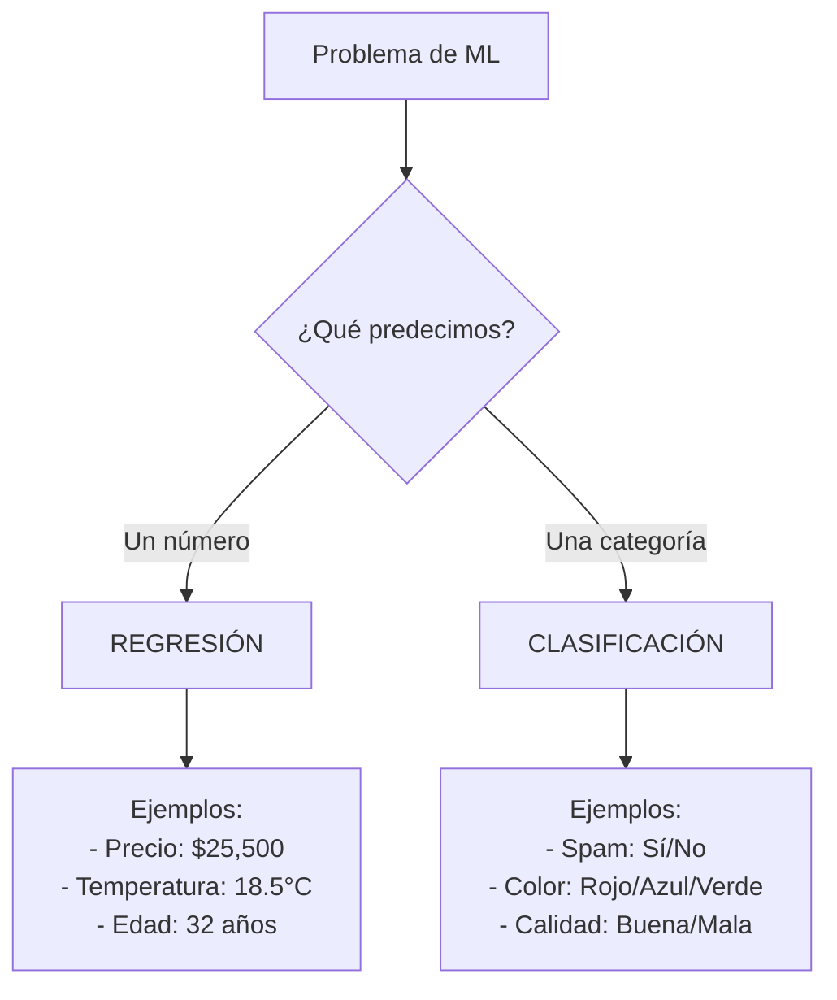
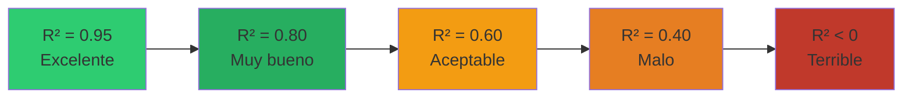
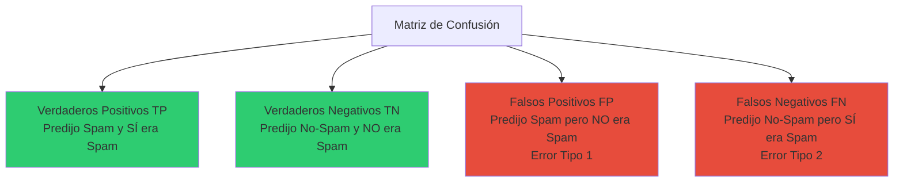
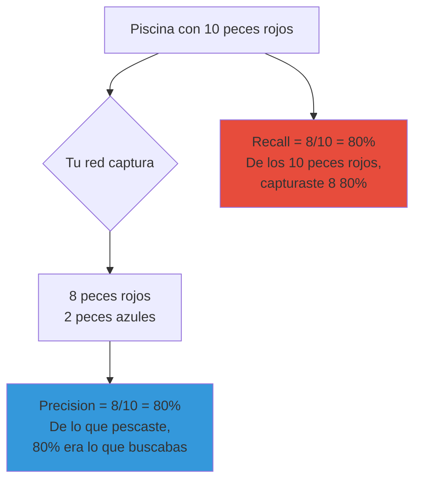

# Métricas de Machine Learning: Regresión vs Clasificación

## Introducción

En Machine Learning, las **métricas** son herramientas que nos ayudan a medir qué tan bien está funcionando nuestro modelo. Imagina que son como las calificaciones en la escuela: nos dicen si vamos bien o si necesitamos estudiar más.

Pero aquí está lo interesante: **no todas las métricas sirven para todo**. Dependiendo del tipo de problema que estemos resolviendo, usamos diferentes métricas.

## ¿Qué es Regresión y qué es Clasificación?

Antes de hablar de métricas, entendamos la diferencia fundamental:

### Regresión
**Predecimos un número continuo** (puede tomar cualquier valor en un rango)

**Ejemplos:**
- Predecir el precio de una casa: $250,000, $300,500, $425,750...
- Predecir la temperatura: 15.5°C, 22.3°C, 18.1°C...
- Predecir el precio de un automóvil: $18,500, $45,200...
- Predecir las ventas del próximo mes: $152,350

### Clasificación
**Predecimos una categoría o clase** (opciones limitadas y discretas)

**Ejemplos:**
- Predecir si un correo es spam o no spam (2 clases)
- Predecir el tipo de flor: rosa, tulipán, girasol (3 clases)
- Predecir si un cliente comprará: sí o no (2 clases)
- Predecir el sentimiento: positivo, neutral, negativo (3 clases)



## Métricas de Regresión

Cuando predecimos números, queremos saber: **¿Qué tan cerca estamos del valor real?**

### 1. MAE (Mean Absolute Error - Error Absoluto Medio)

**¿Qué es?**
El promedio de las diferencias (en valor absoluto) entre lo que predijimos y el valor real.

**Fórmula simple:**
```
MAE = Promedio(|Predicción - Valor Real|)
```

**Ejemplo:**
Imagina que predices precios de casas:

| Casa | Precio Real | Predicción | Error |
|------|-------------|------------|-------|
| 1    | $300,000    | $310,000   | $10,000 |
| 2    | $250,000    | $240,000   | $10,000 |
| 3    | $400,000    | $420,000   | $20,000 |

```
MAE = (10,000 + 10,000 + 20,000) / 3 = $13,333
```

**Interpretación:**
"En promedio, mis predicciones se equivocan por $13,333"

**¿Cuándo usarlo?**
- Cuando quieres una métrica fácil de entender
- Cuando todos los errores tienen la misma importancia
- Cuando quieres reportar a gente no técnica

**Ventajas:**
- Fácil de interpretar (está en las mismas unidades que tu variable)
- No es muy sensible a valores extremos (outliers)

**Desventajas:**
- No penaliza más los errores grandes

---

### 2. MSE (Mean Squared Error - Error Cuadrático Medio)

**¿Qué es?**
El promedio de las diferencias al cuadrado entre predicción y valor real.

**Fórmula simple:**
```
MSE = Promedio((Predicción - Valor Real)²)
```

**Usando el mismo ejemplo:**

| Casa | Precio Real | Predicción | Error | Error² |
|------|-------------|------------|-------|--------|
| 1    | $300,000    | $310,000   | $10,000 | 100,000,000 |
| 2    | $250,000    | $240,000   | $10,000 | 100,000,000 |
| 3    | $400,000    | $420,000   | $20,000 | 400,000,000 |

```
MSE = (100,000,000 + 100,000,000 + 400,000,000) / 3 = 200,000,000
```

**¿Por qué elevar al cuadrado?**
Porque penaliza más los errores grandes. Un error de $20,000 pesa 4 veces más que un error de $10,000 (20² vs 10²).

**Desventajas:**
- Difícil de interpretar (las unidades están al cuadrado: dólares²)
- Muy sensible a outliers

---

### 3. RMSE (Root Mean Squared Error - Raíz del Error Cuadrático Medio)

**¿Qué es?**
La raíz cuadrada del MSE. Esto lo devuelve a las unidades originales.

**Fórmula simple:**
```
RMSE = √(MSE)
```

**Usando el ejemplo:**
```
RMSE = √(200,000,000) = $14,142
```

**Interpretación:**
"En promedio, mis predicciones se equivocan por unos $14,142"

**¿Cuándo usarlo?**
- Es la métrica más común en regresión
- Cuando quieres penalizar más los errores grandes
- Cuando necesitas una métrica diferenciable (para optimización)

**Ventajas:**
- Penaliza más los errores grandes
- Está en las mismas unidades que tu variable
- Muy usada, fácil de comparar con otros modelos

**Desventajas:**
- Sensible a outliers (un error gigante puede disparar el RMSE)

---

### 4. R² (Coeficiente de Determinación)

**¿Qué es?**
Mide qué porcentaje de la variabilidad de los datos es explicado por tu modelo.

**Rango de valores:**
- R² = 1.0 (100%): Modelo perfecto, explica toda la variabilidad
- R² = 0.5 (50%): Modelo explica la mitad de la variabilidad
- R² = 0.0 (0%): Modelo no mejor que predecir siempre el promedio
- R² < 0: Modelo peor que predecir siempre el promedio (¡muy malo!)

**Ejemplo visual:**



**Interpretación:**
- R² = 0.85 → "Mi modelo explica el 85% de la variabilidad en los precios"
- R² = 0.60 → "Mi modelo explica el 60% de la variabilidad"

**¿Cuándo usarlo?**
- Cuando quieres saber qué tan bueno es tu modelo en general
- Para comparar modelos (mayor R² es mejor)
- Para reportar resultados (es fácil de entender)

**Ventajas:**
- Independiente de la escala (sirve para comparar cualquier problema)
- Muy intuitivo (es un porcentaje)

**Desventajas:**
- No te dice la magnitud del error (puedes tener R²=0.95 pero errores grandes si tu variable tiene mucho rango)

---

## Métricas de Clasificación

Cuando predecimos categorías, queremos saber: **¿Qué tan seguido acertamos la clase correcta?**

### Matriz de Confusión

Antes de entender las métricas, necesitamos entender la **matriz de confusión**. Es una tabla que muestra nuestros aciertos y errores.

**Ejemplo: Detector de Spam**

|                | Predijo: NO SPAM | Predijo: SPAM |
|----------------|------------------|---------------|
| **Real: NO SPAM** | 85 (TN)       | 5 (FP)        |
| **Real: SPAM**    | 10 (FN)       | 100 (TP)      |

**Términos:**
- **TP (True Positive)**: Predijimos SPAM y era SPAM ✓ (100 correos)
- **TN (True Negative)**: Predijimos NO SPAM y no era SPAM ✓ (85 correos)
- **FP (False Positive)**: Predijimos SPAM pero NO era SPAM ✗ (5 correos) - ERROR TIPO 1
- **FN (False Negative)**: Predijimos NO SPAM pero SÍ era SPAM ✗ (10 correos) - ERROR TIPO 2



---

### 1. Accuracy (Exactitud)

**¿Qué es?**
El porcentaje de predicciones correctas sobre el total.

**Fórmula:**
```
Accuracy = (TP + TN) / (TP + TN + FP + FN)
```

**Usando el ejemplo del spam:**
```
Accuracy = (100 + 85) / (100 + 85 + 5 + 10)
         = 185 / 200
         = 0.925 = 92.5%
```

**Interpretación:**
"Acierto el 92.5% de las veces"

**¿Cuándo usarlo?**
- Cuando las clases están balanceadas (similar cantidad de cada clase)
- Cuando todos los errores son igual de costosos

**⚠️ CUIDADO: El Problema de las Clases Desbalanceadas**

Imagina que tienes 95 correos legítimos y 5 spam. Si tu modelo predice SIEMPRE "no spam", tendrías:
```
Accuracy = 95/100 = 95%
```

¡95% de accuracy pero no detecta NINGÚN spam! Por eso el accuracy puede engañar.

---

### 2. Precision (Precisión)

**¿Qué es?**
De todos los que predijimos como positivos, ¿cuántos realmente lo eran?

**Pregunta que responde:**
"Cuando digo que algo es spam, ¿qué tan seguido tengo razón?"

**Fórmula:**
```
Precision = TP / (TP + FP)
```

**Ejemplo:**
```
Precision = 100 / (100 + 5) = 0.952 = 95.2%
```

**Interpretación:**
"Cuando marco un correo como spam, tengo razón el 95.2% de las veces"

**¿Cuándo es importante?**
- Cuando los falsos positivos son costosos
- Ejemplo: Detectar fraude (no quieres bloquear clientes legítimos)
- Ejemplo: Diagnóstico médico (no quieres decir que alguien está enfermo si no lo está)

---

### 3. Recall (Sensibilidad / Exhaustividad)

**¿Qué es?**
De todos los positivos reales, ¿cuántos detectamos?

**Pregunta que responde:**
"De todos los correos spam que existen, ¿cuántos logré detectar?"

**Fórmula:**
```
Recall = TP / (TP + FN)
```

**Ejemplo:**
```
Recall = 100 / (100 + 10) = 0.909 = 90.9%
```

**Interpretación:**
"Logro detectar el 90.9% de los correos spam que existen"

**¿Cuándo es importante?**
- Cuando los falsos negativos son costosos
- Ejemplo: Detectar cáncer (no quieres dejar pasar un caso positivo)
- Ejemplo: Detectar fraude (mejor revisar de más que dejar pasar uno)

---

### 4. F1-Score

**¿Qué es?**
El balance entre Precision y Recall. Es la media armónica de ambos.

**Fórmula:**
```
F1 = 2 × (Precision × Recall) / (Precision + Recall)
```

**Ejemplo:**
```
F1 = 2 × (0.952 × 0.909) / (0.952 + 0.909)
   = 2 × 0.865 / 1.861
   = 0.930 = 93.0%
```

**¿Cuándo usarlo?**
- Cuando quieres un balance entre Precision y Recall
- Cuando las clases están desbalanceadas
- Cuando tanto los falsos positivos como los falsos negativos son importantes

---

## Comparación Visual: Precision vs Recall

Imagina que estás pescando:



- **Alta Precision, Bajo Recall**: Pescas pocos peces, pero casi todos son los correctos
- **Bajo Precision, Alto Recall**: Pescas muchos peces, pero varios no son los que buscas
- **Balance (F1-Score alto)**: Pescas muchos de los correctos y pocos incorrectos

---

## Tabla Resumen: ¿Qué Métrica Usar Cuándo?

### Regresión

| Métrica | Cuándo Usarla | Ejemplo |
|---------|---------------|---------|
| **MAE** | Cuando todos los errores importan igual | Predecir ventas (un error de $1000 es el doble de malo que uno de $500) |
| **RMSE** | Cuando quieres penalizar más los errores grandes | Predecir precios de casas (un error de $100k es mucho peor que uno de $10k) |
| **R²** | Para evaluar qué tan bueno es tu modelo en general | Comparar si Modelo A (R²=0.85) es mejor que Modelo B (R²=0.70) |

### Clasificación

| Métrica | Cuándo Usarla | Ejemplo |
|---------|---------------|---------|
| **Accuracy** | Cuando las clases están balanceadas | Predecir si una moneda es cara o cruz (50%-50%) |
| **Precision** | Cuando los falsos positivos son costosos | Detectar fraude (no bloquear clientes legítimos) |
| **Recall** | Cuando los falsos negativos son costosos | Detectar enfermedades (no queremos dejar pasar ningún caso) |
| **F1-Score** | Cuando quieres un balance entre precision y recall | Clasificar emails como spam (balance entre no molestar usuarios y detectar spam) |

---

## Ejemplo Completo: Proyecto de Predicción de Precios de Automóviles

En nuestro proyecto de automóviles, estamos haciendo **REGRESIÓN** (predecimos un precio numérico).

### Métricas que usamos:

**1. RMSE = $1,309**
- "En promedio, nuestras predicciones se equivocan por unos $1,309"
- Si el rango de precios es $1,000 - $80,000, este error es pequeño

**2. MAE = $632**
- "En promedio, nuestras predicciones se alejan $632 del precio real"
- Más fácil de interpretar que RMSE

**3. R² = 0.95**
- "Nuestro modelo explica el 95% de la variabilidad en los precios"
- ¡Excelente! Significa que el modelo captura muy bien los patrones

### ¿Por qué NO usamos Accuracy, Precision, Recall?

Porque esas métricas son para **clasificación** (predecir categorías).

Si quisiéramos convertir esto en clasificación, tendríamos que hacer algo como:
- "Económico" (<$10,000)
- "Medio" ($10,000-$30,000)
- "Costoso" (>$30,000)

Pero perderíamos información valiosa (la diferencia entre $10,000 y $9,999 no es tan grande como para cambiar de categoría).

---

## Ejercicio de Reflexión

**Pregunta:** ¿Qué métricas usarías en estos casos?

1. **Predecir si un estudiante aprobará o reprobará un examen**
   - Tipo: Clasificación
   - Métricas sugeridas: Accuracy (si hay similar cantidad de aprobados y reprobados), Recall si es importante detectar a todos los que podrían reprobar

2. **Predecir la temperatura máxima del próximo día**
   - Tipo: Regresión
   - Métricas sugeridas: MAE (fácil de entender: "nos equivocamos por 2°C en promedio"), RMSE

3. **Detectar transacciones fraudulentas (1% de las transacciones son fraude)**
   - Tipo: Clasificación con clases muy desbalanceadas
   - Métricas sugeridas: Precision (no queremos bloquear transacciones legítimas), Recall (no queremos dejar pasar fraudes), F1-Score

4. **Predecir cuántos clientes visitarán tu tienda mañana**
   - Tipo: Regresión
   - Métricas sugeridas: MAE, RMSE, R²

---

## Conclusión

La elección de métricas depende de:

1. **Tipo de problema**
   - Regresión → RMSE, MAE, R²
   - Clasificación → Accuracy, Precision, Recall, F1-Score

2. **Balance de clases**
   - Balanceado → Accuracy está bien
   - Desbalanceado → Precision, Recall, F1-Score

3. **Costo de los errores**
   - Falsos positivos costosos → Alta Precision
   - Falsos negativos costosos → Alto Recall
   - Ambos importantes → F1-Score

4. **Interpretabilidad**
   - Para audiencia no técnica → MAE, R², Accuracy
   - Para audiencia técnica → RMSE, F1-Score

**Recuerda:** No hay una métrica perfecta. A menudo reportamos varias métricas para tener una visión completa del desempeño del modelo.
